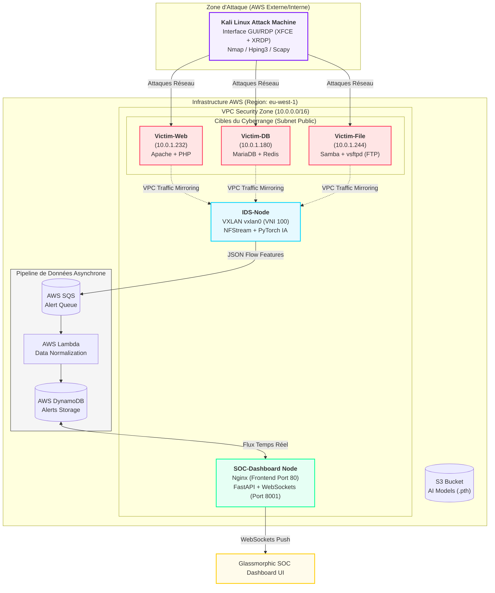
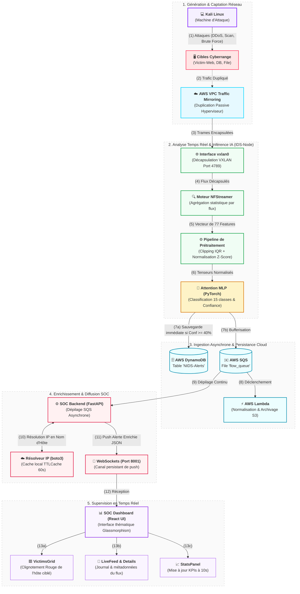

# PFE-NIDS-AI : Deep Learning-based Network Intrusion Detection System

[](https://opensource.org/licenses/Apache-2.0)
[](https://www.python.org/downloads/)
[](https://aws.amazon.com/)
[](https://www.terraform.io/)

## Présentation du Projet

Ce projet est un **Système de Détection d'Intrusion Réseau (NIDS)** développé dans le cadre d'un Projet de Fin d'Études (PFE). Il utilise des techniques avancées de **Deep Learning** pour identifier et classifier les cyber-attaques en temps réel en analysant les motifs du trafic réseau.

Contrairement aux systèmes IDS traditionnels basés sur des signatures, ce système utilise l'analyse comportementale pour détecter les menaces connues ainsi que les attaques sophistiquées de type **Zero-day**.

---

## Menaces Détectées

Le système est entraîné pour identifier avec précision les vecteurs d'attaque suivants :
- **DDoS / DoS** : GoldenEye, Hulk, Slowloris, etc.
- **Scanning** : Port Scanning (Nmap), Vulnerability Scanning.
- **Brute Force** : SSH, FTP (via Hydra).
- **Web Attacks** : SQL Injection, XSS, Infiltration.
- **Botnets & Malware** : Détection des communications C2.

---

- **Détection Multi-Architecture** : Évaluation de 11 modèles de Deep Learning (Attention MLP, CNN-LSTM, Transformers, etc.).
- **Temps Réel** : Pipeline d'inférence haute performance avec une latence < 5ms par flux.
- **Cloud Native** : Infrastructure AWS industrialisée via **Terraform** (IaC).
- **Dashboard Premium** : Interface SOC interactive en **ReactJS + Vite** (design Glassmorphism, thèmes **Dark / Light**, menu repliable avec persistance locale, rafraîchissement des graphes optimisé à 10s et filtrage par date ultra-réactif sur tous les flux en direct et historiques).
- **Mirroring Passif** : Utilisation d'AWS VPC Traffic Mirroring pour analyser le trafic sans impact sur les performances des cibles.
- **Automated Lab** : Simulation d'attaques automatisée via scripts Python (Scapy) et Kali Linux.

---

## Performance des Modèles

Le projet a comparé **11 architectures différentes** sur le dataset **CICIDS 2017**.

| Modèle | Précision (%) | F1-Score (%) | AUC-ROC | Temps d'Entraînement |
| :--- | :---: | :---: | :---: | :---: |
| **Attention MLP** | **98.28** | **98.29** | **0.9995** | **Rapide (258s)** |
| **CNN-LSTM** | 98.14 | 97.99 | 0.9995 | Lent (3502s) |
| **ResNet1D** | 98.14 | 98.12 | 0.9995 | Moyen (639s) |
| BiLSTM | 97.92 | 97.94 | 0.9992 | Lent (2227s) |
| Transformers | 97.58 | 97.47 | 0.9991 | Très Lent (3213s) |

> [!TIP]
> Le modèle **Attention MLP** a été sélectionné pour le déploiement final en raison de son excellent compromis entre précision chirurgicale et efficacité de calcul.

---

## Architecture du Système

L'infrastructure est entièrement déployée sur **AWS (Region: eu-west-1)** et utilise une approche hybride associant des instances EC2 spécialisées et un pipeline serverless asynchrone pour la persistance des alertes.




---

## Pipeline de Détection et d'Alerte Étape par Étape

Le diagramme de flux (workflow) ci-dessous illustre le parcours d'un flux de données réseau, depuis le déclenchement d'une cyber-attaque sur la zone d'entraînement jusqu'à sa visualisation en temps réel sur le tableau de bord du SOC :



---

## Stack Technique

- **Intelligence Artificielle** : PyTorch, Scikit-learn, Pandas, NFStreamer.
- **Backend & API** : FastAPI, Pydantic, WebSockets.
- **Frontend** : ReactJS (Vite + Component-driven design), CSS3 Glassmorphic Cyberpunk, Lucide Icons, Chart.js.
- **Infrastructure** : AWS (EC2, Lambda, SQS, DynamoDB, S3, VPC Mirroring).
- **IaC & DevOps** : Terraform, Ansible, Git.

---

## Installation & Déploiement

### 1. Prérequis
- Python 3.10+
- Node.js & npm (pour le développement/build frontend)
- Compte AWS configuré
- Terraform & Ansible installés

### 2. Déploiement Cloud (Terraform & Ansible)
```bash
# 1. Déployer l'infrastructure sur AWS
cd terraform
terraform init
terraform apply -auto-approve

# 2. Configurer et orchestrer le Cyberrange (depuis la racine)
cd ..
./setup_range.sh
```
Ce script `setup_range.sh` génère l'inventaire Ansible de manière dynamique et applique le playbook `ansible/playbook.yml` pour provisionner et démarrer tous les services ainsi que le NIDS.

### 3. Lancer le Dashboard Localement (Mode Debug)
```bash
# Dans un premier terminal (Backend FastAPI) :
cd soc_dashboard/backend
python3 -m venv venv && source venv/bin/activate
pip install -r requirements.txt
python main.py

# Dans un second terminal (Frontend React + Vite) :
cd soc_dashboard/frontend
npm install
npm run dev
```

---

## Documentation Complète

Pour plus de détails sur les spécifications techniques et les choix de conception, consultez le [Cahier des Charges](CAHIER_DES_CHARGES.md).

---

## Auteur
- **Mathieu** - Étudiant en Ingénierie Cyber-sécurité / IA.

---
*Ce projet a été réalisé dans le cadre d'un Stage de Fin d'Études (PFE).*
