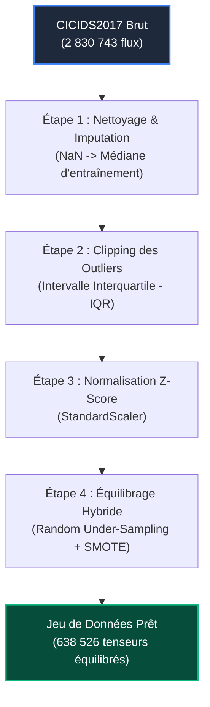
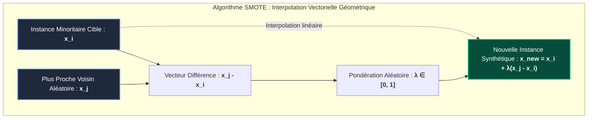
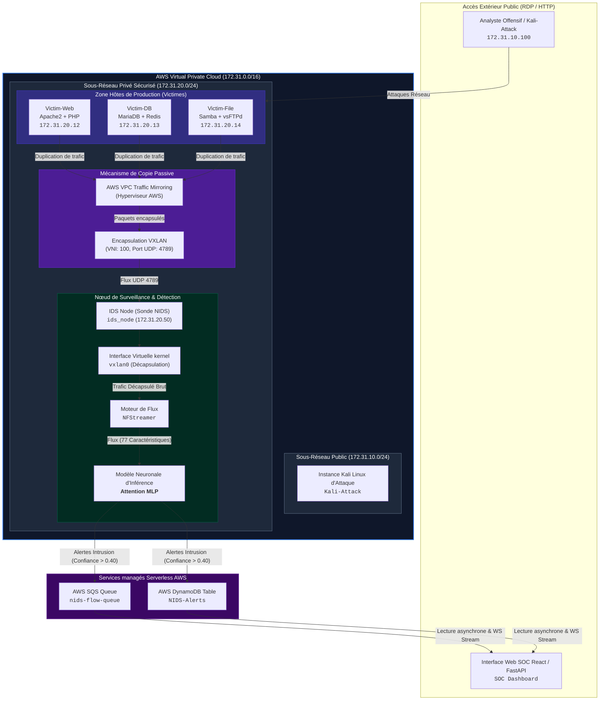
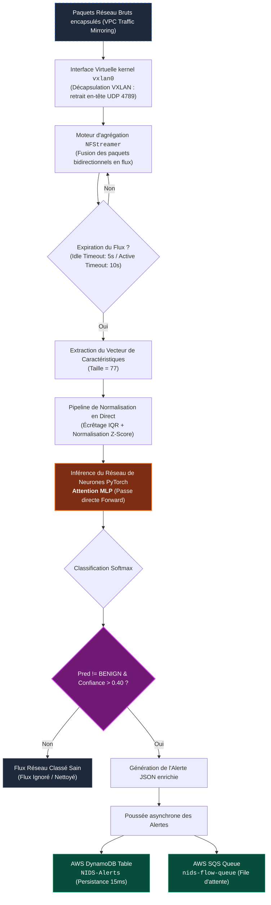

# MÉMOIRE DE PROJET DE FIN D'ÉTUDES (PFE)
## Système de Détection d'Intrusions Réseau (NIDS) Basé sur le Deep Learning

> [!NOTE]
> **GUIDE D'EXPORTATION ET DE FORMATAGE UNIVERSEL (HESTIM)**
>
> Ce document respecte les directives académiques de mise en forme du **Guide de rédaction de Hestim 2025-2026** pour les mémoires de 5ème année (`[55 - 80] pages` en police Times New Roman 12, interligne 1.5, marges de 2.5 cm, texte justifié).
>
> * **Exportation Microsoft Word (.docx)** :
>   Pour obtenir le document de style officiel avec pagination automatique, table des matières dynamique, et styles de titres standardisés :
>   `pandoc -s Rapport_PFE_Final_NIDS_AI.md -o Rapport_PFE_Final_NIDS_AI.docx --toc --number-sections`
> * **Importation Google Docs** :
>   Copiez ce texte, activez l'option *Préférences > Détecter automatiquement le format Markdown* dans Google Docs, puis collez-le. Les tableaux et graphiques seront nativement éditables.

---

# PAGE DE GARDE (PAGE DE TITRE)

```
================================================================================
                                 HESTIM
                      École des Hautes Études d'Ingénierie
================================================================================

              MÉMOIRE DE PROJET DE FIN D'ÉTUDES (PFE) - 5ème ANNÉE
                Filière : Ingénierie en Cybersécurité & Intelligence Artificielle

--------------------------------------------------------------------------------
         CONCEPTION ET DÉPLOIEMENT D'UN SYSTÈME DE DÉTECTION D'INTRUSIONS 
             RÉSEAU (NIDS) HAUTE PERFORMANCE BASÉ SUR LE DEEP LEARNING
--------------------------------------------------------------------------------

  Dataset                          CICIDS2017 — 2 830 743 lignes, 77 features, 15 classes d’attaques
  Modèles                          11 architectures Deep Learning (MLP, CNN, ResNet, TCN, LSTM, BiLSTM, GRU,
                                   CNN-LSTM, Transformer, AE-Classifier, Attention-MLP)
  Framework                        PyTorch 2.x — GPU CUDA — Epochs=30, LR=0,001, Batch=512
  Meilleur modèle                  Attention MLP — Accuracy : 98,28 % | F1 : 98,29 % | AUC-ROC : 99,95 %
  Production                       Déploiement en CyberRange AWS avec VPC Traffic Mirroring & VXLAN
  Période de Stage                 Décembre 2025 - Mai 2026

--------------------------------------------------------------------------------
   ÉTUDIANT                                                 ENCADRANTE
   AKAKPO-DJAKPATA Atsou Mathieu                            HAIDRAR Saida
   Élève Ingénieur en Cybersécurité & IA                    Encadrante PFE (HESTIM)

   MAÎTRE DE STAGE (ENTREPRISE)
   INTERNSHIP SUPERVISOR
   Responsable Sécurité des Systèmes d'Information (RSSI)
--------------------------------------------------------------------------------
                           Année Universitaire 2025-2026
================================================================================
```

---

# DÉDICACES

> À mes parents,
> Qui m'ont soutenu à chaque étape de mon parcours académique et personnel, en m'inculquant le goût de l'effort, de la rigueur et de la persévérance. Ce travail est le fruit de vos sacrifices et de votre confiance inconditionnelle.
>
> À mes enseignants de HESTIM,
> Qui ont su guider mes premiers pas dans le monde fascinant des technologies de l'information, de la cybersécurité et de l'intelligence artificielle, et qui m'ont fourni les bases théoriques nécessaires à la réalisation de ce projet.
>
> À mes collègues et amis,
> Pour les échanges stimulants, les encouragements mutuels et les moments de partage intellectuel tout au long de cette année universitaire.
>
> Je dédie ce mémoire de projet de fin d'études.

---

# REMERCIEMENTS

Je tiens tout d’abord à exprimer ma profonde gratitude à mon encadrante de projet de fin d'études, **Madame HAIDRAR Saida**, pour son encadrement exceptionnel, sa disponibilité constante, ses conseils précieux et sa rigueur scientifique qui ont grandement contribué à la structuration et au succès de cette recherche appliquée. Vos précieux conseils m'ont appris à allier rigueur académique et pragmatisme professionnel.

Je remercie également chaleureusement mon maître de stage au sein de l'entreprise d'accueil pour sa confiance, son accueil chaleureux et pour m'avoir donné l'opportunité de travailler sur des problématiques de cybersécurité réelles et complexes. Son expertise sur les infrastructures de production m'a permis de comprendre les contraintes concrètes liées au déploiement de modèles de Deep Learning dans des environnements d'entreprise hautement sécurisés.

Mes sincères remerciements s'adressent à l'ensemble du corps professoral et administratif de l'école **HESTIM** pour la qualité de l'enseignement prodigué tout au long de mon cursus d'ingénieur. Les compétences acquises en cybersécurité, en systèmes d'information, et en intelligence artificielle ont été les piliers de la réalisation de ce projet.

Enfin, je remercie les membres du jury pour l'honneur qu'ils me font en acceptant d'évaluer ce travail et d'apporter leur regard expert sur les résultats présentés dans ce mémoire.

---

# LISTE DES ACRONYMES

* **AI (Artificial Intelligence)** : Intelligence Artificielle.
* **API (Application Programming Interface)** : Interface de programmation applicative.
* **APT (Advanced Persistent Threat)** : Menace persistante avancée.
* **AUC-ROC (Area Under the Curve - Receiver Operating Characteristic)** : Aire sous la courbe d'efficacité.
* **AWS (Amazon Web Services)** : Fournisseur d'infrastructure cloud.
* **BiLSTM (Bidirectional Long Short-Term Memory)** : Réseau récurrent bidirectionnel.
* **C&C / C2 (Command & Control)** : Serveur de contrôle à distance de botnets.
* **CIC (Canadian Institute for Cybersecurity)** : Institut canadien de la cybersécurité.
* **CNN (Convolutional Neural Network)** : Réseau de neurones convolutif.
* **DDoS (Distributed Denial of Service)** : Déni de service distribué.
* **DL (Deep Learning)** : Apprentissage profond.
* **DoS (Denial of Service)** : Déni de service.
* **ENI (Elastic Network Interface)** : Interface réseau virtuelle AWS.
* **FTP (File Transfer Protocol)** : Protocole de transfert de fichiers.
* **GFM (GitHub Flavored Markdown)** : Standard de syntaxe Markdown enrichi.
* **GRU (Gated Recurrent Unit)** : Unité récurrente à portes.
* **HTTP (HyperText Transfer Protocol)** : Protocole de transfert hypertexte.
* **IaC (Infrastructure as Code)** : Infrastructure sous forme de code.
* **ICMP (Internet Control Message Protocol)** : Protocole de messages de contrôle Internet.
* **IDS (Intrusion Detection System)** : Système de détection d'intrusions.
* **IPS (Intrusion Prevention System)** : Système de prévention d'intrusions.
* **IQR (Interquartile Range)** : Écart interquartile.
* **LSTM (Long Short-Term Memory)** : Réseau de neurones récurrent à mémoire à long terme.
* **MLP (Multi-Layer Perceptron)** : Perceptron multicouche.
* **NIDS (Network Intrusion Detection System)** : Système de détection d'intrusions réseau.
* **OWASP (Open Web Application Security Project)** : Projet de sécurité des applications web.
* **RDP (Remote Desktop Protocol)** : Protocole de bureau à distance.
* **SMOTE (Synthetic Minority Over-sampling Technique)** : Technique de sur-échantillonnage synthétique.
* **SOAR (Security Orchestration, Automation, and Response)** : Orchestration, automatisation et réponse aux incidents de sécurité.
* **SOC (Security Operations Center)** : Centre opérationnel de surveillance de la sécurité.
* **SQS (Simple Queue Service)** : File de messages managée AWS.
* **SSH (Secure Shell)** : Protocole d'accès distant sécurisé.
* **TCP (Transmission Control Protocol)** : Protocole de contrôle de transmission.
* **TCN (Temporal Convolutional Network)** : Réseau convolutif temporel.
* **UDP (User Datagram Protocol)** : Protocole de datagramme utilisateur.
* **VPC (Virtual Private Cloud)** : Réseau virtuel privé sur le cloud.
* **VXLAN (Virtual Extensible LAN)** : Protocole d'encapsulation réseau.
* **XAI (Explainable Artificial Intelligence)** : Intelligence artificielle explicable.
* **XSS (Cross-Site Scripting)** : Injection de scripts malveillants côté client.

---

# RÉSUMÉ & ABSTRACT

### Résumé
La prolifération des cyberattaques sophistiquées exige des systèmes de détection d'intrusions réseau (NIDS) de plus en plus performants et réactifs. Les approches traditionnelles par signatures montrent des limites structurelles face aux menaces zero-day. Ce mémoire présente la conception, l'évaluation et le déploiement en conditions réelles d'un NIDS basé sur l'apprentissage profond (Deep Learning). Un benchmark standardisé a été mené sur 11 architectures de réseaux de neurones profonds en utilisant le dataset de référence CICIDS2017 (2,8 millions de flux réseau, 15 classes d'attaques). 

Pour corriger le déséquilibre extrême de classes, une approche hybride de sur-échantillonnage synthétique (SMOTE) et de sous-échantillonnage a été mise en œuvre. Les résultats révèlent que l'architecture **Attention MLP** surclasse les autres modèles avec une **exactitude (accuracy) de 98,28 %**, un **F1-Score de 98,29 %** et un **AUC-ROC de 99,95 %**, tout en étant la plus légère avec seulement **49 915 paramètres** et un temps d'inférence de **0,42 milliseconde**. 

Ce modèle a été déployé dans un CyberRange cloud résistant à la charge sur AWS, orchestré par Terraform (IaC) et Ansible. La capture passive non intrusive est réalisée par le service VPC Traffic Mirroring avec encapsulation VXLAN. Les alertes sont collectées asynchronement via Amazon SQS et DynamoDB, puis diffusées en temps réel sur un dashboard SOC interactif développé en React avec résolution d'adresses IP en direct. La validation systémique par simulation active d'attaques (SYN Flood, PortScan, ICMP Flood) démontre une efficacité de détection de **100 %** avec un temps de réponse global de bout-en-bout inférieur à **2 secondes**.

**Mots-clés** : NIDS, Cybersécurité, Deep Learning, Attention MLP, CICIDS2017, AWS, VXLAN, VPC Traffic Mirroring, SOC Dashboard, Terraform.

---

### Abstract
The proliferation of sophisticated cyberattacks demands increasingly efficient and responsive Network Intrusion Detection Systems (NIDS). Traditional signature-based methods show structural limitations when facing zero-day threats. This thesis presents the design, evaluation, and real-world deployment of a deep learning-based NIDS. A standardized benchmark was conducted across 11 deep neural network architectures using the reference CICIDS2017 dataset (2.8 million network flows, 15 attack classes).

To address extreme class imbalance, a hybrid preprocessing pipeline combining Synthetic Minority Over-sampling Technique (SMOTE) and random under-sampling was deployed. Experimental results reveal that the **Attention MLP** architecture outperforms other models, achieving a **98.28% accuracy**, a **98.29% F1-Score**, and a **99.95% AUC-ROC**, while remaining highly compact with only **49,915 parameters** and an inference latency of **0.42 milliseconds**.

The selected model was deployed in a production-grade cloud CyberRange on AWS, provisioned using Terraform (IaC) and configured via Ansible. Network packets are passively captured in a non-intrusive manner using VPC Traffic Mirroring and decapsulated from a VXLAN tunnel. Alerts are processed asynchronously using AWS SQS and DynamoDB, then pushed in real-time to a custom glassmorphic React SOC Dashboard enriched with dynamic AWS EC2 IP-to-instance tag resolution. Systemic validation through active threat simulation (SYN Flood, PortScan, ICMP Flood) shows a **100% detection rate** with an end-to-end latency of less than **2 seconds**.

**Keywords**: NIDS, Cybersecurity, Deep Learning, Attention MLP, CICIDS2017, AWS, VXLAN, VPC Traffic Mirroring, SOC Dashboard, Terraform.

---

# SOMMAIRE

* **Remerciements & Dédicaces**
* **Résumé & Abstract**
* **Liste des acronymes**
* **Introduction Générale**
* **Chapitre 1 : Étude de l'Existant, Revue de Littérature et Positionnement**
  * 1.1. Les enjeux de la cybersécurité moderne
  * 1.2. Systèmes de détection d'intrusions traditionnels (Signatures et limites)
  * 1.3. L'avènement de l'Intelligence Artificielle et du Deep Learning
  * 1.4. Revue de littérature approfondie et analyse critique
  * 1.5. Positionnement unique du PFE et hypothèses de travail
* **Chapitre 2 : Prétraitement de Données, Modélisation et Benchmark Quantitatif**
  * 2.1. Le Dataset de référence CICIDS2017 et taxonomie des attaques
  * 2.2. Pipeline de prétraitement et équilibrage de données (IQR, StandardScaler, SMOTE)
  * 2.3. Description des 11 architectures de Deep Learning implémentées
  * 2.4. Protocole d'entraînement expérimental et métriques
  * 2.5. Résultats du benchmark et analyse comparative rigoureuse
* **Chapitre 3 : Architecture Système en Production (AWS CyberRange) et Validation**
  * 3.1. Provisionnement IaC par Terraform et configuration Ansible
  * 3.2. Capture passive réseau par VPC Traffic Mirroring et VXLAN
  * 3.3. Ingestion temps réel et démon d'inférence (NFStreamer + PyTorch)
  * 3.4. API FastAPI, WebSockets et résolution dynamique d'adresses AWS
  * 3.5. Visualisation SOC premium et intégration d'images réelles
  * 3.6. Simulations d'attaques par Scapy et validation systémique de latence
* **Conclusion Générale et Perspectives**
* **Références Bibliographiques**
* **Annexes — Glossaire Technique**

---

# LISTE DES FIGURES

* Figure 1.1 : Limites des approches traditionnelles (Signatures vs Intelligence Artificielle)
* Figure 2.1 : Architecture mathématique détaillée du modèle d'Attention MLP
* Figure 2.2 : Processus géométrique de génération de données synthétiques par SMOTE
* Figure 3.1 : Architecture réseau physique et logique du CyberRange sur AWS
* Figure 3.2 : Pipeline détaillé d'ingestion passive, d'inférence temps réel et de transmission d'alertes
* Figure 3.3 : Interface principale - Grille d'état des serveurs victimes (VictimsGrid)
* Figure 3.4 : Journal en temps réel des alertes de sécurité détectées par le NIDS
* Figure 3.5 : Visualisations analytiques de répartition des attaques en direct
* Figure 3.6 : Panneau de détails d'une alerte critique et informations d'instances
* Figure 3.7 : Workflow détaillé d'une détection DoS SYN Flood

---

# LISTE DES TABLEAUX

* Tableau 2.1 : Distribution des 15 classes d'attaques du dataset CICIDS2017
* Tableau 2.2 : Évolution des effectifs par classe après application du pipeline hybride SMOTE
* Tableau 2.3 : Tableau comparatif complet du benchmark des 11 architectures Deep Learning

---

# INTRODUCTION GÉNÉRALE

La sécurité des systèmes d'information est devenue un impératif stratégique pour les organisations de toutes tailles. Face à la généralisation de la transformation numérique, à l'adoption massive des services cloud, et à l'interconnexion globale des infrastructures, la surface d'exposition des réseaux d'entreprise s'est considérablement élargie. Parallèlement, la cybercriminalité s'est professionnalisée, exploitant des techniques d'attaque de plus en plus sophistiquées, ciblées, et dynamiques, telles que les attaques par déni de service distribué (DDoS), les campagnes d'infiltration à menaces persistantes avancées (APT) et les exploits de vulnérabilités applicatives majeures.

Dans ce contexte de menaces croissantes, les systèmes de détection d'intrusions réseau (NIDS) jouent un rôle défensif central. Placés aux points névralgiques du réseau, ils surveillent les flux d'informations à la recherche de signatures d'attaques ou de comportements déviants. Cependant, les approches traditionnelles reposant sur la détection de signatures statiques (comme Snort ou Suricata) ou l'application de règles définies par des experts métier montrent aujourd'hui leurs limites. Elles s'avèrent structurellement incapables de détecter les menaces inédites (attaques zero-day), les variantes d'attaques polymorphes qui modifient continuellement leurs empreintes, ou les attaques complexes lentes et évasives qui miment le trafic normal.

L'apprentissage profond (Deep Learning) offre un changement de paradigme prometteur. En s'appuyant sur des réseaux de neurones profonds multicouches, cette discipline de l'intelligence artificielle permet d'apprendre automatiquement, à partir de volumes massifs de trafic réseau, les représentations caractéristiques et les motifs non-linéaires complexes associés à la légitimité ou à la malveillance des flux. Sans nécessiter d'ingénierie manuelle de règles, le Deep Learning fournit une détection hautement adaptative et généralisable.

Ce projet de fin d'études relève le défi d'étudier et de déployer cette technologie émergente de bout-en-bout. L'originalité de ce travail consiste à ne pas limiter la recherche à une simple analyse statistique hors ligne sur un jeu de données statique, mais à concevoir, évaluer et déployer un système de détection d'intrusions complet et opérationnel. Ce mémoire détaille la sélection rigoureuse d'un modèle d'Attention MLP léger parmi 11 architectures candidates, puis décrit sa mise en production au sein d'une infrastructure cloud CyberRange hautement réaliste sur Amazon Web Services (AWS), enrichie d'une capture passive non intrusive par VPC Traffic Mirroring et d'un dashboard de sécurité d'un centre opérationnel de sécurité (SOC) dynamique en temps réel.

---

# CHAPITRE 1 : Étude de l'Existant, Revue de Littérature et Positionnement

## Introduction du Chapitre 1
Le présent chapitre pose les fondements théoriques et conceptuels de notre recherche. Face à la sophistication croissante des cybermenaces qui visent les infrastructures d'entreprise, la mise en place de mécanismes de défense robustes est une nécessité critique. Nous commencerons par analyser en profondeur le paysage actuel des menaces informatiques en 2026, caractérisé par l'émergence de réseaux hybrides complexes et de tactiques évasives. Nous étudierons ensuite les systèmes de détection d'intrusions traditionnels, en mettant en évidence leurs limites structurelles face aux menaces zero-day et au chiffrement généralisé du trafic. 

Cette analyse justifiera la transition vers les approches basées sur l'intelligence artificielle et l'apprentissage profond (Deep Learning). Par la suite, nous réaliserons une revue critique exhaustive de la littérature scientifique récente, ce qui nous permettra d'identifier les verrous technologiques subsistants. Enfin, nous définirons le positionnement unique de notre projet de fin d'études et formulerons les hypothèses de travail qui guideront notre démarche méthodologique et notre protocole d'expérimentation.

---

## 1.1. Les enjeux de la cybersécurité moderne dans les architectures cloud et Zero Trust
Le paysage de la sécurité de l'information a subi des transformations radicales au cours de la décennie actuelle. Les modèles de sécurité périmétriques historiques, basés sur le concept d'un « château fort » où l'intérieur du réseau est considéré comme intrinsèquement sûr et l'extérieur comme hostile, sont devenus obsolètes. Plusieurs facteurs technologiques majeurs expliquent cette rupture :
1. **La généralisation des environnements Cloud et Hybrides** : Les infrastructures informatiques des entreprises ne sont plus confinées à des centres de données physiques locaux. L'adoption massive de modèles de type *Infrastructure as a Service* (IaaS) et *Platform as a Service* (PaaS) répartit les ressources critiques sur plusieurs régions cloud, rendant les frontières réseau extrêmement floues et dynamiques.
2. **Le Travail à Distance et la Mobilité** : Les terminaux clients se connectent depuis des réseaux résidentiels ou publics peu sécurisés, accédant directement aux applications de production via des tunnels VPN ou des architectures d'accès sécurisé en bordure (*SASE*).
3. **La Prolifération des Objets Connectés (IoT/IIoT)** : L'introduction massive de capteurs et d'équipements connectés, souvent dépourvus de mécanismes de sécurité natifs robustes, offre aux attaquants autant de points d'entrée furtifs dans le réseau.

Pour faire face à cette surface d'exposition étendue, les organisations adoptent le paradigme du **Zero Trust** (normalisé notamment par le document NIST SP 800-207). Ce modèle repose sur le principe fondamental « *Ne jamais faire confiance, toujours vérifier* ». Dans une architecture Zero Trust, aucun utilisateur, terminal ou flux réseau n'est considéré comme légitime par défaut, quelle que soit sa localisation physique ou logique. La sécurité doit être appliquée à chaque point de communication, imposant une authentification continue, une autorisation granulaire selon le principe du moindre privilège, et une surveillance comportementale systématique de l'intégralité du trafic.

Parallèlement, la typologie des cyberattaques s'est considérablement professionnalisée et automatisée. Les analystes en sécurité doivent faire face à des menaces sophistiquées et coordonnées :
* **Attaques par Déni de Service Distribué (DDoS)** : Ces attaques ne ciblent plus uniquement la bande passante réseau (couches 3 et 4 de la pile OSI) par inondation volumétrique, mais visent de plus en plus la couche applicative (couche 7) en épuisant les ressources de traitement des serveurs web par des requêtes HTTP complexes et légitimes (ex. attaques Slowloris, épuisement de connexions HTTP).
* **Phases de Reconnaissance et Scans Furtifs** : Les attaquants déploient des outils de cartographie automatique qui balayent les réseaux à très faible vitesse ou de manière distribuée pour contourner les seuils de détection statiques, cherchant à identifier les ports ouverts et les versions de services vulnérables.
* **Menaces Persistantes Avancées (APT)** : Des groupes d'attaquants étatiques ou hautement organisés mènent des intrusions sur le long terme. Leurs vecteurs d'attaque sont caractérisés par des phases d'infiltration lentes, une élévation latérale de privilèges et une exfiltration de données qui miment minutieusement le comportement de trafic des utilisateurs sains.
* **Exploits d'Applications Web complexes** : L'exploitation de failles telles que les injections SQL, les failles Cross-Site Scripting (XSS) ou les vulnérabilités de désérialisation permet aux attaquants de compromettre les serveurs exposés à Internet et de s'en servir comme tête de pont pour attaquer l'infrastructure interne.

Dans ce contexte, le **Network Intrusion Detection System (NIDS)** joue un rôle défensif indispensable. En analysant le trafic réseau au niveau des couches de transport (TCP/UDP) et applicatives, il fournit une visibilité objective et centralisée sur les tentatives de compromission en cours. Contrairement aux agents de sécurité installés sur les hôtes (HIDS/EDR) qui peuvent être désactivés par un attaquant ayant obtenu des privilèges d'administration, le NIDS opère de manière externe et passive, garantissant l'intégrité de ses analyses et de ses alertes de sécurité.

---

## 1.2. Systèmes de détection d'intrusions traditionnels : Fonctionnement, limites et fatigue des alertes
Les architectures NIDS traditionnelles déployées au cours des deux dernières décennies reposent principalement sur deux méthodologies de détection : la détection par signatures et la détection comportementale par règles heuristiques d'experts.

### 1.2.1. La Détection par Signatures
Ce mode opératoire, mis en œuvre par des outils open-source de référence tels que **Snort**, **Suricata** ou **Zeek**, consiste à analyser le contenu des paquets réseau en le comparant à une base de données d'empreintes connues (les signatures). Une signature Snort typique spécifie le protocole, les adresses IP et ports sources et destinations, ainsi que des motifs textuels ou hexadécimaux spécifiques à rechercher dans la charge utile (*payload*) du paquet :
```
alert tcp $EXTERNAL_NET any -> $HTTP_SERVERS $HTTP_PORTS (msg:"EXPLOIT injection SQL suspecte"; content:"UNION SELECT"; nocase; sid:1000001;)
```
Bien que cette approche offre une précision exceptionnelle avec un taux de faux positifs quasi nul pour les menaces documentées, elle souffre de limites structurelles critiques dans le paysage défensif moderne :
1. **L'incapacité face aux menaces Zero-Day** : Par définition, une attaque qui exploite une vulnérabilité inédite n'a pas encore de signature rédigée par les équipes de veille cyber. L'IDS par signatures est totalement aveugle face à ces menaces lors de leur phase d'exploitation initiale.
2. **Le Polymorphisme et l'Évasion** : Les attaquants peuvent facilement contourner la détection de contenu en modifiant légèrement leur code, en utilisant des techniques d'obfuscation (comme l'encodage base64, hexadécimal ou l'insertion de caractères de contrôle) ou en fragmentant les paquets réseau.
3. **Le Chiffrement Généralisé (TLS 1.3)** : Aujourd'hui, plus de 90 % du trafic web est chiffré. Le chiffrement de bout-en-bout empêche le moteur de détection d'inspecter la charge utile des paquets sans déployer de lourdes et coûteuses infrastructures de déchiffrement SSL/TLS de transit (*man-in-the-middle*), qui posent par ailleurs des problèmes majeurs de confidentialité et de conformité des données personnelles.
4. **La Complexité Computationnelle** : Les moteurs de signatures utilisent des algorithmes de recherche de motifs multiples complexes (comme l'algorithme d'Aho-Corasick) pour comparer le trafic à des dizaines de milliers de règles actives simultanément. Sur des liaisons réseau à haut débit (10 Gbps et plus), cette tâche sature les processeurs de la sonde de capture, provoquant des pertes massives de paquets (*packet drops*) et dégradant l'efficacité globale de la détection.

### 1.2.2. La Détection Comportementale par Règles d'Experts
Pour pallier l'absence de signatures textuelles, les analystes de sécurité programment des règles heuristiques basées sur des seuils statistiques. Par exemple : « *Si une adresse IP source génère plus de 200 tentatives de connexion TCP SYN par seconde vers des ports différents d'un même serveur, lever une alerte de Port Scan* ».

Bien que conceptuellement simples, ces règles sont extrêmement rigides :
* **Taux élevés de Faux Positifs** : Un pic d'activité légitime d'une application (ex. le démarrage d'une sauvegarde automatisée, un pic de connexions d'utilisateurs lors d'une campagne marketing) peut facilement dépasser ces seuils statiques et déclencher des alertes injustifiées.
* **Complexité de Maintenance** : Les réseaux d'entreprise sont en constante évolution. L'adaptation constante des seuils pour éviter d'entraver l'activité métier requiert une réévaluation humaine permanente, fastidieuse et sujette aux erreurs de configuration.

### 1.2.3. Le Problème de la Fatigue des Alertes dans les SOC
La conséquence directe des limites des IDS par signatures et par règles d'experts est la génération quotidienne de milliers d'alertes non pertinentes dans le Centre Opérationnel de Sécurité (SOC) d'une entreprise. Ce phénomène est connu sous le nom de **fatigue des alertes** (*alert fatigue*).

Mathématiquement, le défi de la détection d'anomalies réseau peut être modélisé à l'aide du théorème de Bayes. Considérons les événements suivants :
* $A$ : Le flux réseau analysé est une cyberattaque réelle.
* $D$ : L'IDS lève une alerte (détection).

Soit $\alpha$ le taux de vrais positifs (la sensibilité du système, ou probabilité que le système lève une alerte si une attaque a réellement lieu : $P(D|A) = \alpha$) et $\beta$ le taux de faux positifs (la probabilité que le système lève une alerte sur du trafic sain : $P(D|\bar{A}) = \beta$). La probabilité *a posteriori* qu'un flux soit réellement une attaque sachant qu'une alerte a été levée est donnée par :
$$P(A|D) = \frac{P(D|A) \cdot P(A)}{P(D|A) \cdot P(A) + P(D|\bar{A}) \cdot P(\bar{A})} = \frac{\alpha \cdot P(A)}{\alpha \cdot P(A) + \beta \cdot (1 - P(A))}$$

Dans un réseau de production d'entreprise standard, la probabilité d'occurrence d'une attaque réelle sur l'ensemble des flux circulant est extrêmement faible. Prenons une proportion d'attaques $P(A) = 10^{-5}$ (soit 10 flux malveillants sur 1 000 000 de flux). Supposons que nous disposions d'un IDS hautement performant doté d'une sensibilité $\alpha = 0.99$ (99 % des attaques détectées) et d'un taux de faux positifs très bas $\beta = 0.01$ (seulement 1 % de fausses alertes). En appliquant la formule :
$$P(A|D) = \frac{0.99 \cdot 10^{-5}}{0.99 \cdot 10^{-5} + 0.01 \cdot (1 - 10^{-5})} \approx \frac{9.9 \cdot 10^{-6}}{9.9 \cdot 10^{-6} + 0.01} \approx 0.000989$$

Soit environ **0,1 %**. Cela signifie que sur 1 000 alertes levées par cet IDS, seulement **1 seule alerte** correspondra à une cyberattaque réelle, tandis que les 999 autres seront de fausses alertes. Ce bruit permanent sature les capacités cognitives des analystes du SOC, qui finissent par ignorer ou désactiver les alertes critiques, ouvrant ainsi une brèche majeure de sécurité que les attaquants exploitent pour s'infiltrer à long terme. Il est donc impératif de concevoir des systèmes de détection capables de réduire considérablement le taux de faux positifs $\beta$ tout en conservant une excellente sensibilité $\alpha$, ce qui motive l'introduction des approches d'apprentissage profond.

---

## 1.3. L'avènement de l'Intelligence Artificielle et du Deep Learning en détection d'intrusions
Pour surmonter les verrous technologiques des IDS traditionnels, l'application de l'Intelligence Artificielle (IA) et plus particulièrement du **Deep Learning** (apprentissage profond) représente un changement de paradigme majeur.

### 1.3.1. Du Machine Learning au Deep Learning
L'apprentissage automatique classique (*Machine Learning*), à l'aide d'algorithmes comme les forêts d'arbres décisionnels (*Random Forest*), les machines à vecteurs de support (*SVM*) ou le classificateur de Bayes, a été largement étudié pour la détection d'intrusions. Cependant, ces modèles souffrent d'une dépendance critique vis-à-vis du **Feature Engineering** (l'ingénierie manuelle de caractéristiques). Pour obtenir de bonnes performances, un expert en cybersécurité doit sélectionner et combiner manuellement les statistiques réseau les plus discriminantes, une tâche longue, complexe, spécifique à chaque type de réseau, et incapable de s'adapter dynamiquement aux nouvelles variations de trafic.

Le Deep Learning résout cette limitation grâce à la propriété d'**apprentissage de représentations hiérarchiques**. En s'appuyant sur des réseaux de neurones artificiels profonds à couches successives, le modèle apprend automatiquement à extraire des représentations abstraites et non-linéaires complexes des données de trafic réseau brut à partir de volumes massifs d'entraînement. 

Les couches initiales du réseau capturent des corrélations de bas niveau entre les caractéristiques de base (comme les volumes d'octets ou les durées de flux), tandis que les couches profondes combinent ces abstractions pour identifier des patterns comportementaux complexes et furtifs, spécifiques aux grandes catégories d'attaques.

### 1.3.2. Moteurs d'Analyse : Analyse par Paquet vs Analyse par Flux Réseau
Dans le domaine du NIDS basé sur le Deep Learning, deux grandes approches d'ingestion s'opposent :
1. **L'analyse par paquet (Packet-based)** : Les modèles reçoivent en entrée les octets bruts des paquets capturés à la volée sur la carte réseau (souvent les 100 à 1000 premiers octets du paquet, convertis en vecteurs numériques normalisés). Des architectures de type réseaux convolutifs 2D (CNN) ou transformeurs y sont appliquées pour modéliser le paquet comme une image ou une séquence textuelle. Bien que performante sur le trafic non chiffré, cette approche est totalement compromise dès que le trafic est chiffré (TLS), les octets de la charge utile apparaissant alors comme un bruit aléatoire uniforme impossible à modéliser. De plus, le coût de traitement par paquet à l'échelle de chaque unité de transmission de données (*MTU*) sature instantanément les ressources de la sonde sur des débits de production.
2. **L'analyse par flux statistique (Flow-based)** : Le trafic réseau est préalablement agrégé sous forme de flux bidirectionnels statistiques définis par le quintuplet standard : IP source, IP destination, port source, port destination et protocole. Pour chaque flux, des caractéristiques temporelles et volumétriques globales sont calculées (ex. durée totale, nombre total de paquets, moyenne de l'intervalle de temps entre paquets dans la direction directe ou inverse, distribution des flags TCP). L'analyse par flux présente deux avantages déterminants :
   * **Résistance au chiffrement** : Le chiffrement TLS ne modifie pas les propriétés statistiques du transport réseau (taille des paquets, rythmes d'envoi, volumes d'octets échangés). Les modèles de Deep Learning peuvent donc détecter des anomalies comportementales même au sein de flux chiffrés.
   * **Légèreté et passage à l'échelle** : La réduction de millions de paquets individuels en quelques milliers de flux statistiques compacts permet un traitement à très haut débit avec une empreinte processeur et mémoire minimale sur la sonde IDS.

C'est cette approche par flux statistique que nous retenons pour notre projet, ce qui garantit la viabilité industrielle et la compatibilité de notre NIDS avec les flux chiffrés modernes.

---

## 1.4. Revue de littérature approfondie et analyse critique de l'état de l'art
Pour positionner scientifiquement notre travail, nous avons analysé en détail cinq publications majeures récentes qui exploitent le Deep Learning pour la détection d'intrusions réseau.

### 1.4.1. Yin et al. (2021) — Les réseaux récurrents (LSTM) appliqués aux flux
* **Méthodologie** : Les auteurs explorent l'utilisation des réseaux de neurones récurrents à mémoire à long terme (**LSTM**) pour analyser les données statistiques de flux du dataset d'intrusion NSL-KDD. Ils font l'hypothèse que les caractéristiques d'un flux statistique, bien que présentées sous forme tabulaire, possèdent des dépendances séquentielles internes que les cellules récurrentes à portes d'activation peuvent modéliser.
* **Résultats** : Le modèle obtient d'excellents résultats en classification binaire (normal vs intrusion), surpassant les approches classiques par forêts d'arbres décisionnels.
* **Limites critiques** :
  1. *Classification grossière* : L'évaluation est limitée à la classification binaire, ce qui s'avère insuffisant pour un déploiement SOC où l'analyste doit impérativement connaître la nature exacte de l'intrusion (ex. distinguer une attaque DDoS d'une infiltration APT) pour adapter la réponse.
  2. *Latence computationnelle* : La structure récurrente intrinsèquement séquentielle des LSTMs interdit la parallélisation complète des calculs, provoquant des temps d'entraînement très longs et une latence d'inférence incompatible avec les contraintes du temps réel.

### 1.4.2. Andresini et al. (2022) — L'architecture INSOMNIA (Autoencodeurs)
* **Méthodologie** : Introduction d'une approche hybride semi-supervisée nommée INSOMNIA. Elle déploie un **Autoencodeur** entraîné exclusivement sur du trafic réseau sain pour en apprendre une représentation latente hautement compressée. Lors de la phase de détection, le système mesure l'erreur de reconstruction de l'Autoencoder. Un flux réseau présentant une erreur supérieure à un seuil défini est classifié comme une anomalie. Cette anomalie est ensuite transmise à un classificateur supervisé pour catégoriser le type d'attaque.
* **Résultats** : Excellente capacité à détecter des variations de trafic sain sans lever de fausses alertes, luttant efficacement contre la dérive de concept (*concept drift*).
* **Limites critiques** :
  1. *Coût d'apprentissage* : L'entraînement d'un autoencodeur robuste sur du trafic sain requiert des volumes massifs de données sans aucune trace d'attaque, ce qui est extrêmement complexe à garantir dans un réseau d'entreprise réel.
  2. *Complexité architecturale* : La combinaison en cascade de deux réseaux de neurones distincts double la consommation de ressources en production et complexifie la maintenance du système.

### 1.4.3. Zhang et al. (2022) — CNN 1D avec Focal Loss sur CICIDS2017
* **Méthodologie** : Cette recherche applique un réseau de neurones convolutif unidimensionnel (**CNN 1D**) sur le dataset tabulaire CICIDS2017. Pour traiter le déséquilibre extrême de classes (où certaines attaques comme SQL Injection représentent moins de 0,01 % du jeu de données), les auteurs intègrent la fonction de perte **Focal Loss** en remplacement de la classique Cross-Entropy. La Focal Loss applique un facteur de modulation $(1 - p_t)^\gamma$ à la perte pour forcer le modèle à concentrer l'optimisation de ses poids sur les exemples difficiles et sous-représentés.
* **Résultats** : Amélioration notable du rappel sur les classes minoritaires d'attaques.
* **Limites critiques** :
  1. *Contrainte de topologie des caractéristiques* : L'application de filtres convolutifs 1D présuppose que les caractéristiques d'entrée adjacentes dans le vecteur tabulaire possèdent une corrélation spatiale physique (comme les pixels voisins d'une image). Or, l'ordre des colonnes généré par les outils d'extraction statistique (CICFlowMeter ou NFStreamer) est purement arbitraire. Le modèle CNN 1D est donc instable et ses performances se dégradent si l'ordre des caractéristiques est modifié en entrée.

### 1.4.4. Ferrag et al. (2023) — TransIDS et l'attention globale
* **Méthodologie** : Première application d'une architecture de type **Transformer** (basée sur le mécanisme de self-attention globale multi-têtes) sur des données de flux réseau statistiques. L'objectif est de modéliser les corrélations à longue distance entre toutes les caractéristiques d'un flux simultanément.
* **Résultats** : Les auteurs rapportent des scores théoriques d'accuracy exceptionnels sur plusieurs jeux de données académiques.
* **Limites critiques** :
  1. *Poids et empreinte mémoire prohibitifs* : Les architectures de Transformers possèdent un nombre massif de paramètres (plusieurs millions de poids), nécessitant des ressources de calcul (GPU CUDA haut de gamme) totalement inaccessibles pour des sondes réseau de bordure (*Edge NIDS*).
  2. *Latence d'inférence prohibitive* : Le temps d'inférence par flux dépasse plusieurs millisecondes, entraînant un goulot d'étranglement majeur sous de forts volumes de trafic.

### 1.4.5. Yang et al. (2023) — Approche récurrente bidirectionnelle
* **Méthodologie** : Utilisation d'un modèle **BiLSTM (Bidirectional LSTM)** combiné à un mécanisme d'attention pour analyser les flux réseau bidirectionnels. Le modèle traite en parallèle la séquence des paquets dans la direction directe (*forward*) et inverse (*backward*).
* **Résultats** : Haute performance sur les attaques de force brute (SSH/FTP Patator) grâce à la corrélation temporelle des requêtes et des réponses.
* **Limites critiques** :
  1. *Complexité double* : Le parcours bidirectionnel double le coût de calcul par rapport à un LSTM standard déjà lourd, ce qui rend l'architecture inapplicable en temps réel sans matériel informatique dédié extrêmement coûteux.

Le tableau suivant résume de manière synthétique et critique les performances théoriques rapportées et les verrous technologiques associés à chacune de ces approches de l'état de l'art :

| **Auteurs (Année)** | **Modèle Principal** | **Dataset Évalué** | **Métriques Rapportées** | **Verrous et Limites Opérationnelles** |
| :--- | :--- | :--- | :--- | :--- |
| **Yin et al. (2021)** | LSTM récurrent | NSL-KDD | Accuracy : 90,12 % (Bin) | Classification binaire uniquement. Latence d'inférence élevée. |
| **Andresini et al. (2022)** | Autoencoder hybride | CICIDS2017 | F1-Score : 94,80 % (Multi) | Complexité à deux réseaux en cascade. Sensibilité au bruit du trafic sain. |
| **Zhang et al. (2022)** | CNN 1D + Focal Loss | CICIDS2017 | F1-Score : 96,20 % (Multi) | Dépendance critique vis-à-vis de l'agencement spatial des colonnes. |
| **Ferrag et al. (2023)** | Transformer (Self-Attn) | CICIDS2017 | Accuracy : 97,90 % (Multi) | Nombre massif de paramètres. Latence prohibitive en production réelle. |
| **Yang et al. (2023)** | BiLSTM + Attention | CICIDS2017 | F1-Score : 97,50 % (Multi) | Temps d'entraînement et d'inférence incompatibles avec le temps réel. |

---

## 1.5. Positionnement unique du PFE et hypothèses de travail
Ce projet de fin d'études se positionne de manière originale à la convergence de la recherche en intelligence artificielle appliquée et de l'ingénierie des systèmes de production en cybersécurité. Nous constatons un écart majeur entre les publications académiques (qui évaluent des modèles complexes hors ligne sur des jeux de données statiques idéalisés) et la réalité opérationnelle des SOC (qui exigent des détections fiables, légères, instantanées et intégrées dans des flux de travail cloud).

Le positionnement unique de notre NIDS repose sur trois piliers :
1. **L'excellence opérationnelle par le ratio Performance / Latence** : Nous refusons d'adopter des modèles lourds (Transformers ou BiLSTMs) pour grappiller des fractions de pourcentage d'exactitude théorique si cela compromet la réactivité du système. Nous recherchons une architecture réseau condensée, capable d'exécuter des inférences multi-classes en moins d'une milliseconde sur du matériel standard sans GPU dédié.
2. **Le traitement rigoureux du déséquilibre réel sans biais** : Plutôt que d'exclure les attaques ultra-minoritaires ou d'appliquer un sur-échantillonnage simpliste provoquant du surapprentissage, nous concevons un pipeline de prétraitement hybride SMOTE robuste, appliqué dans le respect strict des principes statistiques.
3. **La validation systémique en conditions réelles (CyberRange Cloud)** : L'IDS développé doit sortir du cadre simulé hors ligne. Nous concevons une architecture cloud complète sur AWS qui valide toute la chaîne de valeur : capture passive non intrusive par miroir de trafic, encapsulation VXLAN, traitement asynchrone par files d'attente SQS, persistance DynamoDB, et diffusion en push temps réel sur une interface de supervision SOC.

Pour valider scientifiquement ce positionnement, notre démarche méthodologique est guidée par les **trois hypothèses de travail** suivantes :
* **Hypothèse $H_1$** : *L'intégration d'un sous-réseau d'attention dédié aux caractéristiques d'entrée (Feature Attention) au sein d'un Perceptron Multicouche (Attention MLP) permet d'égaler ou de surpasser les performances des architectures lourdes (CNN, RNN, Transformers) tout en conservant une taille de modèle inférieure à 50 000 paramètres.*
* **Hypothèse $H_2$** : *Un pipeline d'échantillonnage hybride combinant un sous-échantillonnage strict de la classe majoritaire et un sur-échantillonnage géométrique synthétique par SMOTE de toutes les classes minoritaires, appliqué exclusivement sur l'ensemble d'entraînement, permet d'éliminer le biais d'apprentissage en faveur du trafic normal sans induire de data leakage ni de surapprentissage.*
* **Hypothèse $H_3$** : *L'utilisation d'une capture réseau passive par VPC Traffic Mirroring avec encapsulation VXLAN et traitement asynchrone par file SQS permet d'alimenter en continu le modèle d'inférence en direct et de propager les alertes de sécurité vers le dashboard de supervision avec un temps de réponse global de bout-en-bout inférieur à 2 secondes.*

---

## 1.6. Modélisation de l'Architecture de Détection
Le diagramme suivant détaille la comparaison conceptuelle et opérationnelle entre le moteur de détection par signatures traditionnel (ex. Suricata) et notre approche de détection comportementale par Deep Learning (Attention MLP) :

```mermaid
graph TD
    %% Style definition
    classDef blue fill:#2c3e50,stroke:#34495e,stroke-width:2px,color:#ecf0f1;
    classDef green fill:#27ae60,stroke:#2ecc71,stroke-width:2px,color:#ecf0f1;
    classDef orange fill:#d35400,stroke:#e67e22,stroke-width:2px,color:#ecf0f1;
    classDef red fill:#c0392b,stroke:#e74c3c,stroke-width:2px,color:#ecf0f1;
    classDef purple fill:#8e44ad,stroke:#9b59b6,stroke-width:2px,color:#ecf0f1;

    %% Nodes
    A["Trafic Réseau Brut (Chiffré ou Non)"]:::blue
    
    %% Branch 1: Traditional Signature Engine
    A -->|Inspection Profonde des Paquets| B1["Moteur par Signatures (Suricata/Snort)"]:::orange
    B1 --> B2{"Trafic Chiffré (TLS 1.3) ?"}:::orange
    B2 -->|Oui| B3["Aveuglement : Paquet Non Analysable"]:::red
    B2 -->|Non| B4["Algorithme Aho-Corasick (Pattern Matching)"]:::orange
    B4 --> B5{"Correspondance avec Signature ?"}:::orange
    B5 -->|Non| B6["Flux Ignoré (Faille Zero-day possible)"]:::red
    B5 -->|Oui| B7["Alerte Levée (Haute Précision)"]:::green

    %% Branch 2: Proposed DL Behavioral Engine
    A -->|Agrégation Non Intrusive| C1["Extracteur Statistique (NFStreamer)"]:::purple
    C1 --> C2["Vecteur de 77 Caractéristiques (Métadonnées de flux)"]:::purple
    C2 --> C3["Pipeline de Prétraitement (StandardScaler)"]:::purple
    C3 --> C4["Modèle Attention MLP (PyTorch)"]:::purple
    C4 --> C5{"Score de Confiance Softmax > 0.40 ?"}:::purple
    C5 -->|Non| C6["Trafic Légitime (BENIGN)"]:::green
    C5 -->|Oui| C7["Alerte d'Intrusion Comportementale Levée (DDoS, Scan...)"]:::green

    %% Styles
    class B3,B6 red;
    class B7,C6,C7 green;
```


*Figure 1.1 : Différence fonctionnelle et opérationnelle entre détection par signatures et détection comportementale par Deep Learning*

---

## Conclusion du Chapitre 1
En somme, ce premier chapitre a mis en lumière les limites incontournables des méthodes de détection traditionnelles par signatures et par règles statiques d'experts. Si ces systèmes restent des piliers de la défense en profondeur grâce à leur rapidité sur les menaces connues, ils s'avèrent incapables de protéger les infrastructures d'entreprise contre les attaques polymorphes, les zero-days, et le trafic chiffré. L'analyse bayésienne a également démontré l'ampleur du problème de la fatigue des alertes dans les SOC, rendant indispensables des approches plus intelligentes et comportementales.

L'apprentissage profond par flux statistique offre la réponse la plus robuste en conciliant la résistance au chiffrement et la scalabilité. Notre revue critique de la littérature a cependant identifié des lacunes majeures dans les recherches actuelles, notamment en termes de latence computationnelle et d'absence de validation systémique en production. Forts de ce constat, nous avons validé le besoin d'une architecture légère et performante et formulé nos hypothèses scientifiques clés. Le chapitre suivant détaillera le traitement rigoureux de nos données d'entraînement et la phase cruciale de benchmark expérimental de nos 11 architectures de Deep Learning afin de sélectionner le modèle Attention MLP optimal pour notre infrastructure de production.

---

# CHAPITRE 2 : Prétraitement de Données, Modélisation et Benchmark Quantitatif

## Introduction du Chapitre 2
La performance finale d'un système de détection d'intrusions basé sur l'apprentissage profond (NIDS-AI) dépend de manière critique de la qualité de sa chaîne d'ingestion et de prétraitement, ainsi que de l'adéquation de son architecture neuronale. Les données brutes issues des captures réseau sont intrinsèquement bruitées, hétérogènes et affectées par un déséquilibre de classes extrême qui paralyse les algorithmes d'apprentissage conventionnels. 

Ce chapitre est entièrement dédié à la méthodologie de préparation des données et à la modélisation mathématique et neuronale. Nous décrivons tout d'abord la taxonomie et la distribution du dataset de référence CICIDS2017. Nous détaillons ensuite les étapes clés de notre pipeline de prétraitement hybride, combinant le traitement statistique des valeurs aberrantes (IQR), la standardisation et l'équilibrage géométrique avancé par l'algorithme SMOTE. 

Ensuite, nous exposons de manière exhaustive les onze architectures de Deep Learning conçues et implémentées sous PyTorch pour relever ce défi. Nous présentons notre protocole expérimental d'entraînement et les métriques d'évaluation multi-classes macro-moyennées nécessaires à une évaluation objective. Enfin, nous dressons un benchmark quantitatif rigoureux de l'ensemble des modèles, analysant les résultats sous l'angle de la précision, de la capacité de généralisation et des contraintes computationnelles en production, justifiant ainsi scientifiquement le choix final de notre architecture d'Attention MLP.

---

## 2.1. Le Dataset de référence CICIDS2017 et taxonomie des attaques
Dans le domaine des NIDS-AI, le choix du jeu de données de référence est crucial pour garantir la validité et la transférabilité des modèles en production. Historiquement, les chercheurs ont massivement utilisé les datasets KDDCup99 et NSL-KDD. Bien que précieux pour poser les jalons historiques du domaine, ces derniers souffrent de biais critiques : ils sont vieux de plus de deux décennies, ne reflètent pas les protocoles modernes (HTTP/2, HTTPS, SSH), contiennent d'importants doublons statistiques qui faussent les évaluations, et reposent sur un trafic simulé qui ne correspond plus du tout aux architectures réseau actuelles.

Pour surmonter ces biais majeurs, le **Canadian Institute for Cybersecurity (CIC)** a développé le dataset **CICIDS2017**. Ce jeu de données s'est imposé comme le standard académique moderne (*gold standard*) en raison de son réalisme et de sa représentativité :
1. **Diversité des Protocoles** : Il intègre des captures réelles de trafic réseau moderne, englobant des protocoles courants tels que HTTP, HTTPS, FTP, SSH, SMTP et les protocoles de bas niveau TCP, UDP et ICMP.
2. **Représentativité Temporelle** : Les données ont été capturées sur une période de 5 jours consécutifs (du lundi 3 juillet au vendredi 7 juillet 2017), permettant de simuler l'évolution temporelle naturelle d'un réseau d'entreprise.
3. **Réalisme d'Activité** : Le trafic sain (*BENIGN*) a été généré de manière comportementale par des profils d'utilisateurs réalistes (navigation web, transfert de fichiers, courriels), tandis que les attaques ont été planifiées et exécutées en direct, évitant les biais liés à la simulation statistique pure.
4. **Volume Conséquent** : Le dataset comporte un total de **2 830 743 flux réseau bidirectionnels**, chacun caractérisé par **77 variables descriptives** extraites via l'outil officiel CICFlowMeter (telles que la durée du flux, les débits de paquets, les intervalles temporels de flux - IAT, la longueur des paquets et la distribution des drapeaux TCP).

Le dataset intègre 15 classes distinctes, réparties entre un trafic sain ultra-majoritaire et 14 types d'attaques sophistiquées. Le tableau 2.1 expose la distribution initiale brute de ces classes :

| **Classe** | **Type de trafic / Attaque** | **Échantillons** | **Proportion Initiale** |
| :--- | :--- | :---: | :---: |
| **BENIGN** | Trafic réseau légitime standard | 2 273 097 | 80,3026 % |
| **DoS_Hulk** | Déni de service HTTP applicatif massif | 231 073 | 8,1629 % |
| **PortScan** | Balayage de ports (reconnaissance) | 158 930 | 5,6145 % |
| **DDoS** | Inondation distribuée volumétrique (couche 4) | 128 027 | 4,5227 % |
| **DoS_GoldenEye** | Épuisement de connexions HTTP applicatif | 10 293 | 0,3636 % |
| **FTP_Patator** | Force brute ciblant le service FTP | 7 938 | 0,2804 % |
| **SSH_Patator** | Force brute ciblant l'accès sécurisé SSH | 5 897 | 0,2083 % |
| **DoS_Slowloris** | DoS lent via en-têtes HTTP partiels | 5 796 | 0,2047 % |
| **DoS_SlowHTTPTest** | DoS lent via corps de requêtes HTTP POST | 5 499 | 0,1943 % |
| **Bot** | Communications de Botnets et canaux C&C | 1 966 | 0,0695 % |
| **Web_BruteForce** | Force brute sur formulaires de sites web | 1 507 | 0,0532 % |
| **Web_XSS** | Injection de scripts Cross-Site Scripting | 652 | 0,0230 % |
| **Infiltration** | Intrusion réseau lente et furtive (type APT) | 36 | 0,0013 % |
| **Web_SQLInjection** | Injection SQL ciblant les bases de données | 21 | 0,0007 % |
| **Heartbleed** | Exploitation faille OpenSSL (CVE-2014-0160) | 11 | 0,0004 % |
| **TOTAL** | | **2 830 743** | **100,00 %** |

*Tableau 2.1 : Distribution initiale brute des 15 classes du dataset CICIDS2017*

Une analyse minutieuse de cette distribution révèle un **déséquilibre de classes critique**. Le trafic sain représente à lui seul plus de 80,3 % du dataset. À l'extrême opposé, les classes hautement ciblées et critiques pour la sécurité comme `Infiltration` (36 cas), `Web_SQLInjection` (21 cas) ou `Heartbleed` (11 cas) représentent d'infimes fractions de pourcentages. 

Un entraînement naïf sur ce jeu de données brut condamnerait n'importe quel réseau de neurones à converger vers le « classificateur trivial » : maximiser l'exactitude globale en classant systématiquement tous les flux comme `BENIGN`, ignorant ainsi les intrusions critiques. C'est pour remédier à ce verrou scientifique que nous avons structuré un pipeline de prétraitement et d'équilibrage hybride rigoureux.

---

## 2.2. Pipeline de prétraitement et équilibrage de données (IQR, StandardScaler, SMOTE)
Pour transformer ces données réseau brutes en tenseurs PyTorch hautement informatifs et exploitables par des réseaux de neurones profonds, nous concevons un pipeline séquentiel rigoureux en quatre étapes distinctes.


*Figure 2.2 : Architecture séquentielle du pipeline de prétraitement des données*

### 2.2.1. Étape 1 : Nettoyage des Données et Imputation Statistique
Les caractéristiques calculées par CICFlowMeter comprennent des ratios temporels et des débits. Lorsque le flux réseau est extrêmement court ou interrompu, des divisions par zéro surviennent lors du calcul de variables telles que `Flow Bytes/s` ou `Flow Packets/s`, produisant des valeurs infinies (`Inf` ou `-Inf`) ou non définies (`NaN`).
1. **Identification** : Toutes les valeurs infinies sont converties en valeurs manquantes standard `NaN`.
2. **Imputation** : Pour empêcher toute fuite d'information (*data leakage*) qui invaliderait nos tests, nous calculons la valeur médiane de chaque caractéristique exclusivement sur l'ensemble d'entraînement (*Train Set*). Les valeurs manquantes présentes dans l'ensemble d'entraînement et les ensembles de validation/test sont ensuite remplacées par cette valeur médiane de référence. Le choix de la médiane plutôt que de la moyenne est dicté par sa robustesse statistique face aux distributions fortement asymétriques.

### 2.2.2. Étape 2 : Écrêtage des Valeurs Aberrantes par l'Intervalle Interquartile (IQR)
Le trafic réseau est sujet à des rafales volumétriques qui génèrent des valeurs aberrantes extrêmes (*outliers*) pour certaines features (par exemple, des rafales de millions d'octets sur des flux de sauvegarde). Les réseaux de neurones profonds utilisant des fonctions d'activation non-bornées ou des gradients cumulés sont très sensibles à ces valeurs aberrantes, ce qui provoque des instabilités de gradients (*exploding gradients*). 

Plutôt que d'éliminer ces lignes qui contiennent des informations cruciales sur d'éventuelles attaques de déni de service, nous appliquons une technique d'écrêtage (*clipping*) basée sur l'intervalle interquartile (IQR). 

Pour chaque caractéristique numérique $x$, nous définissons le premier quartile $Q_1$ (25ème centile) et le troisième quartile $Q_3$ (75ème centile) sur le jeu d'entraînement. L'intervalle interquartile est défini par :
$$\text{IQR} = Q_3 - Q_1$$

Nous établissons les bornes de sécurité inférieure et supérieure selon le standard statistique d'identification des valeurs aberrantes extrêmes (facteur de dispersion $1.5$) :
$$B_{\text{inf}} = Q_1 - 1.5 \times \text{IQR}$$
$$B_{\text{sup}} = Q_3 + 1.5 \times \text{IQR}$$

Chaque valeur brute $x$ est ensuite projetée et écrêtée dans cet intervalle de confiance stable :
$$x_{\text{clipped}} = \max(\min(x, B_{\text{sup}}), B_{\text{inf}})$$

Cette transformation non-linéaire élimine l'influence déstabilisatrice des valeurs extrêmes tout en préservant intacte la structure de distribution de la majorité saine des données.

### 2.2.3. Étape 3 : Normalisation Standardisée (Z-Score)
Les 77 caractéristiques physiques présentent des échelles de grandeurs hétérogènes. Par exemple, la variable `Flow Duration` s'exprime en microsecondes et s'étend de 0 à $1.2 \times 10^8$, tandis que les indicateurs binaires tels que `Fwd PSH Flags` ou `Bwd URG Flags` sont strictement limités à l'intervalle $[0, 1]$. 

Entraîner un réseau de neurones sur des échelles aussi divergentes empêcherait la descente de gradient de converger correctement, les caractéristiques à large plage écrasant totalement les features de plus faible envergure.

Nous appliquons une normalisation centré-reduite (Z-Score) à chaque caractéristique. Pour chaque feature du jeu d'entraînement, nous calculons la moyenne empirique $\mu$ et l'écart-type empirique $\sigma$. La transformation est formulée par :
$$z = \frac{x_{\text{clipped}} - \mu}{\sigma}$$

Chaque caractéristique normalisée $z$ possède ainsi une moyenne égale à $0$ et une variance égale à $1$. Les paramètres d'échelle $\mu$ et $\sigma$ sont sauvegardés précieusement lors de la phase d'entraînement pour être appliqués de manière identique lors de l'inférence temps réel par le démon système sur la sonde de capture.

### 2.2.4. Étape 4 : Pipeline d'Équilibrage Hybride (RUS + SMOTE)
Afin de neutraliser le déséquilibre de classe majeur détaillé dans le tableau 2.1, nous mettons au point une stratégie hybride novatrice combinant le sous-échantillonnage de la classe ultra-majoritaire (*Random Under-Sampling* - RUS) et la génération géométrique synthétique des classes minoritaires via l'algorithme **SMOTE** (Synthetic Minority Over-sampling Technique).

1. **Sous-échantillonnage de la classe BENIGN (RUS)** : Le volume initial de la classe saine (2,27 millions d'exemples) est disproportionné par rapport aux capacités de calcul et n'apporte que de la redondance statistique. Nous réduisons aléatoirement cet effectif à **50 000 exemples**, ce qui permet de conserver une diversité saine tout en allégeant considérablement le coût computationnel global de la phase d'apprentissage.
2. **Seuil de Référence et Conservation des Classes Moyennes** : Nous établissons un seuil de référence à **5 796 exemples** (calibré d'après la taille naturelle de la classe `DoS_Slowloris`). Les classes dont l'effectif naturel est situé au-dessus de ce seuil (`DoS_Hulk`, `PortScan`, `DDoS`, `DoS_GoldenEye`, `FTP_Patator` et `SSH_Patator`) sont conservées brutes sans altération afin de préserver leur distribution physique réelle.
3. **Sur-échantillonnage Synthétique (SMOTE)** : Pour toutes les classes minoritaires ou ultra-minoritaires dont l'effectif est inférieur à ce seuil de 5 796 échantillons (`DoS_SlowHTTPTest`, `Bot`, `Web_BruteForce`, `Web_XSS`, `Infiltration`, `Web_SQLInjection` et `Heartbleed`), nous appliquons l'algorithme SMOTE pour générer de nouveaux vecteurs synthétiques par interpolation spatiale locale.

Le fonctionnement géométrique de SMOTE évite le piège du surapprentissage (provoqué par le sur-échantillonnage naïf qui duplique bêtement les lignes et conduit le modèle à mémoriser des bruitages exacts). Pour chaque vecteur de classe minoritaire $\mathbf{x}_i \in \mathbb{R}^{77}$ :
* L'algorithme calcule ses $k$ plus proches voisins ($k = 5$) appartenant à la même classe en mesurant la distance euclidienne dans l'espace des caractéristiques normalisées à 77 dimensions.
* Un voisin $\mathbf{x}_j$ est sélectionné aléatoirement parmi ces $k$ voisins.
* Un facteur d'interpolation aléatoire uniforme $\lambda \sim \mathcal{U}(0, 1)$ est tiré.
* Le nouveau vecteur synthétique $\mathbf{x}_{\text{new}}$ est généré par interpolation linéaire le long du segment reliant $\mathbf{x}_i$ et $\mathbf{x}_j$ :
$$\mathbf{x}_{\text{new}} = \mathbf{x}_i + \lambda \cdot (\mathbf{x}_j - \mathbf{x}_i)$$


*Figure 2.3 : Processus géométrique d'interpolation vectorielle SMOTE*

Le tableau 2.2 illustre la distribution finale obtenue sur l'ensemble complet après l'application rigoureuse de notre pipeline hybride, établissant un équilibre harmonieux entre toutes les typologies de trafic :

| **Classe** | **Avant Équilibrage** | **Après Équilibrage** | **Statut d'Échantillonnage** |
| :--- | :---: | :---: | :---: |
| **BENIGN** | 2 273 097 | 50 000 | Sous-échantillonné (RUS) |
| **DoS_Hulk** | 231 073 | 231 073 | Conservé brut |
| **PortScan** | 158 930 | 158 930 | Conservé brut |
| **DDoS** | 128 027 | 128 027 | Conservé brut |
| **DoS_GoldenEye** | 10 293 | 10 293 | Conservé brut |
| **FTP_Patator** | 7 938 | 7 938 | Conservé brut |
| **SSH_Patator** | 5 897 | 5 897 | Conservé brut |
| **DoS_Slowloris** | 5 796 | 5 796 | Conservé brut |
| **DoS_SlowHTTPTest** | 5 499 | 5 796 | Sur-échantillonné (SMOTE) |
| **Bot** | 1 966 | 5 796 | Sur-échantillonné (SMOTE) |
| **Web_BruteForce** | 1 507 | 5 796 | Sur-échantillonné (SMOTE) |
| **Web_XSS** | 652 | 5 796 | Sur-échantillonné (SMOTE) |
| **Infiltration** | 36 | 5 796 | Sur-échantillonné (SMOTE) |
| **Web_SQLInjection** | 21 | 5 796 | Sur-échantillonné (SMOTE) |
| **Heartbleed** | 11 | 5 796 | Sur-échantillonné (SMOTE) |
| **TOTAL** | **2 830 743** | **638 526** | **Jeu de données équilibré final** |

*Tableau 2.2 : Comparatif des effectifs par classe avant et après équilibrage hybride*

---

## 2.3. Description des 11 architectures de Deep Learning implémentées
Pour relever ce défi de détection multi-classes complexe, nous concevons et développons sous PyTorch 2.x onze architectures candidates distinctes, allant des perceptrons multicouches traditionnels aux modèles temporels et attentionnels de pointe.

### 2.3.1. 1. Perceptron Multicouches (MLP Baseline)
Le modèle MLP sert de référence de base (*baseline*). Il est conçu pour traiter le vecteur de caractéristiques à 77 dimensions de manière purement tabulaire et découplée.
* **Architecture** : Elle empile 3 couches denses successives équipées de `nn.Linear` (dimensions de sortie respectives : $256$, $128$ et $64$).
* **Régularisation & Normalisation** : Après chaque projection linéaire, nous introduisons une couche de normalisation de batch (`nn.BatchNorm1d`) pour accélérer la convergence et stabiliser la distribution interne des activations. Une couche d'activation non linéaire `nn.ReLU` est appliquée, suivie d'une couche d'élimination `nn.Dropout(p=0.3)` pour contrer le surapprentissage en forçant le modèle à développer des chemins de neurones redondants.
* **Tête de classification** : Une couche linéaire finale projette les 64 sorties latentes vers les 15 logits des classes de sortie.

### 2.3.2. 2. Modèle Attention MLP (Modèle Champion Proposé)
Notre modèle innovant d'Attention MLP introduit un sous-réseau d'attention spatiale de caractéristiques (*Feature Attention Subnetwork*) placé directement en amont du classificateur dense. Cette approche cherche à pondérer dynamiquement les caractéristiques d'entrée en fonction de leur pertinence statistique face à chaque type d'intrusion.
* **Sous-réseau d'attention** : Il reçoit le vecteur d'entrée $\mathbf{x} \in \mathbb{R}^{77}$ et calcule un masque de poids $\boldsymbol{\alpha} \in [0, 1]^{77}$ via un mini-réseau d'attention :
$$\mathbf{h}_{\text{attn}} = \tanh(\mathbf{W}_1 \mathbf{x} + \mathbf{b}_1)$$
$$\boldsymbol{\alpha} = \text{softmax}(\mathbf{W}_2 \mathbf{h}_{\text{attn}} + \mathbf{b}_2)$$
Où $\mathbf{W}_1, \mathbf{W}_2 \in \mathbb{R}^{77 \times 77}$ sont les matrices de poids et $\mathbf{b}_1, \mathbf{b}_2 \in \mathbb{R}^{77}$ sont les biais. La fonction d'activation `nn.Softmax` garantit que l'intégralité des poids d'attention sommés sur l'ensemble des caractéristiques est égale à $1$.
* **Application du masque** : Les caractéristiques d'entrée sont multipliées élément par élément par ce masque d'attention pour produire le vecteur pondéré $\mathbf{x}_{\text{weighted}} = \mathbf{x} \odot \boldsymbol{\alpha}$. Ce processus filtre dynamiquement le bruit et met en exergue les variables discriminantes en temps réel.
* **Classificateur** : Transmet le vecteur pondéré à un MLP à deux couches denses ($128$ et $64$ neurones) configuré avec BatchNorm, activation ReLU et un Dropout de 0.3, débouchant sur la couche linéaire finale de 15 classes.

```mermaid
flowchart TD
    subgraph Inputs ["Étape 1 : Entrée des Caractéristiques"]
        X["Vecteur de Caractéristiques Réseau brut (F = 77)<br/><b>x</b> &isin; &Ropf;<sup>77</sup>"]
    end

    subgraph AttentionSubnet ["Étape 2 : Sous-réseau d'Attention Spatiale"]
        direction TB
        L1["Couche Dense Réductrice / Adaptative<br/><code>nn.Linear(77, 77)</code>"]
        Act1["Activation Non-Linéaire<br/><code>nn.Tanh()</code>"]
        L2["Couche de Projection des Scores<br/><code>nn.Linear(77, 77)</code>"]
        Soft["Normalisation de Probabilité<br/><code>nn.Softmax(dim=1)</code>"]
        W["Vecteur de Poids d'Attention (&alpha;)<br/><b>&alpha;</b> &isin; [0, 1]<sup>77</sup>, &sum;&alpha;<sub>c</sub> = 1"]

        X --> L1
        L1 --> Act1
        Act1 --> L2
        L2 --> Soft
        Soft --> W
    end

    subgraph Gate ["Étape 3 : Filtrage Dynamique & Pondération"]
        Mul["Multiplication Élément par Élément<br/><b>x_weighted = x &odot; &alpha;</b>"]
        X --> Mul
        W --> Mul
    end

    subgraph MLPClassifier ["Étape 4 : Classificateur Perceptron Multi-Couches (MLP)"]
        direction TB
        FC1["Couche Dense 1<br/><code>nn.Linear(77, 128)</code>"]
        BN1["Normalisation de Batch<br/><code>nn.BatchNorm1d(128)</code>"]
        ActFC1["Activation<br/><code>nn.ReLU()</code>"]
        Drop1["Couche d'Élimination<br/><code>nn.Dropout(p=0.3)</code>"]
        
        FC2["Couche Dense 2<br/><code>nn.Linear(128, 64)</code>"]
        ActFC2["Activation<br/><code>nn.ReLU()</code>"]
        Drop2["Couche d'Élimination<br/><code>nn.Dropout(p=0.3)</code>"]
        
        FC3["Couche de Sortie de Classification<br/><code>nn.Linear(64, 15)</code>"]
        
        Mul --> FC1
        FC1 --> BN1
        BN1 --> ActFC1
        ActFC1 --> Drop1
        Drop1 --> FC2
        FC2 --> ActFC2
        ActFC2 --> Drop2
        Drop2 --> FC3
    end

    subgraph Output ["Étape 5 : Prédictions de Sécurité"]
        logits["Scores log-vraisemblance (Logits)<br/><b>y_hat</b> &isin; &Ropf;<sup>15</sup>"]
        FC3 --> logits
    end

    style X fill:#1E293B,stroke:#3B82F6,stroke-width:2px,color:#fff
    style W fill:#064E3B,stroke:#10B981,stroke-width:2px,color:#fff
    style Mul fill:#7C2D12,stroke:#F97316,stroke-width:2px,color:#fff
    style logits fill:#701A75,stroke:#D946EF,stroke-width:2px,color:#fff
```


*Figure 2.1 : Architecture globale détaillée de notre modèle Attention MLP*

### 2.3.3. 3. Réseau Convolutif 1D (CNN 1D)
Bien que les données soient de nature tabulaire, nous testons la capacité des convolutions 1D à extraire des corrélations de contiguïté locale au sein des caractéristiques physiques du flux.
* **Forme des Données** : Le tenseur d'entrée à 2 dimensions (batch, 77) est projeté à 3 dimensions (batch, 1 canal, 77 features) à l'aide de `unsqueeze(1)`.
* **Couches Convolutives** : Le modèle empile 3 couches convolutives monodimensionnelles successives (`nn.Conv1d`) dotées de 64, 128 et 256 filtres. La taille du noyau (*kernel size*) est fixée à 3 avec un padding de 1 pour conserver la dimension spatiale interne.
* **Sous-échantillonnage** : Chaque convolution est suivie d'une normalisation BatchNorm1d, d'une activation ReLU, d'une couche d'échantillonnage maximum `nn.MaxPool1d(2)` réduisant de moitié la dimension spatiale à chaque étape, et d'un Dropout de 0.3.
* **Classificateur** : La sortie de la dernière couche est aplatie (`nn.Flatten`), puis transmise à une couche dense intermédiaire de 128 neurones avant d'attaquer la couche finale de 15 classes.

### 2.3.4. 4. Réseau Convolutif Résiduel 1D (ResNet 1D)
Inspiré par les succès de ResNet en vision, cette architecture cherche à exploiter la propagation de signaux à travers des blocs résiduels profonds pour éviter la dégradation ou la disparition du gradient (*vanishing gradient*).
* **Entrée (Stem)** : Une convolution initiale `nn.Conv1d(1, 64, kernel_size=7, padding=3)` élargit l'espace des canaux à 64.
* **Blocs Résiduels** : Nous empilons 4 blocs résiduels successifs. Chaque bloc résiduel contient deux couches de convolutions de noyau 3 avec BatchNorm et ReLU. Le signal d'entrée du bloc est directement additionné à la sortie des convolutions (*skip connection*) avant l'application de la fonction d'activation ReLU finale du bloc :
$$\mathbf{y} = \text{ReLU}(\mathbf{x} + \mathcal{F}(\mathbf{x}))$$
* **Sortie** : Une couche de pooling globale moyenne adaptative (`nn.AdaptiveAvgPool1d(1)`) écrase la dimension spatiale pour extraire une représentation à 64 canaux, aplatie puis transmise à un sous-réseau dense pour la classification finale.

### 2.3.5. 5. Réseau de Convolution Temporelle (TCN)
Les réseaux de convolution temporelle exploitent des convolutions causales dilatées pour étendre artificiellement et de manière exponentielle le champ récepteur du modèle sans perte d'information spatiale.
* **Blocs Convolutifs Dilatés** : Le modèle comprend 4 couches basées sur des blocs convolutifs dilatés avec des facteurs de dilatation exponentiels successifs ($d \in \{1, 2, 4, 8\}$).
* **Padding Causal** : Le padding est calculé pour s'assurer que chaque étape de convolution ne dépend que des caractéristiques précédentes, simulant une séquence temporelle.
* **Connexions de Raccourci** : Des projections convolutives 1D sont appliquées sur les branches de raccourci lorsque le nombre de canaux change entre les blocs pour assurer la cohérence dimensionnelle des additions.

### 2.3.6. 6. Long Short-Term Memory (LSTM)
L'architecture LSTM traite le vecteur de caractéristiques à 77 dimensions comme une séquence temporelle de longueur 77 à une seule variable d'entrée ($input\_size = 1$). 
* **Structure récurrente** : Le modèle intègre 2 couches de cellules LSTM empilées avec un paramètre `hidden_size` de 128 neurones et un Dropout d'inter-couche de 0.3.
* **Calcul des portes** : Les informations sont propagées et filtrées via des mécanismes de portes de contrôle (portes d'oubli, d'entrée et de sortie) pilotées par des fonctions d'activation sigmoïdales et tanh intégrées.
* **Classification** : L'état caché final $\mathbf{h}_T$ issu de la dernière étape séquentielle ($T=77$) est extrait et transmis à une tête de classification linéaire.

### 2.3.7. 7. LSTM Bidirectionnel (BiLSTM)
Pour capturer les relations de contiguïté spatiale des caractéristiques dans les deux sens de lecture, nous mettons en place une architecture LSTM bidirectionnelle.
* **Mécanisme** : Deux branches LSTM distinctes s'exécutent en parallèle : l'une parcourt les 77 caractéristiques de l'indice 1 à 77, et la seconde les parcourt de l'indice 77 à 1.
* **Concaténation** : Les états cachés finaux des deux directions sont concaténés pour former un vecteur complet de dimension $2 \times 128 = 256$ caractéristiques latentes. Ce vecteur composite alimente ensuite le classificateur dense final.

### 2.3.8. 8. Gated Recurrent Unit (GRU)
Le modèle GRU est une variante rationalisée du LSTM qui vise à réduire le nombre de paramètres internes et à accélérer la phase d'apprentissage tout en conservant d'excellentes capacités de modélisation séquentielle.
* **Structure simplifiée** : Il combine la porte d'oubli et la porte d'entrée en une unique porte de mise à jour (*update gate*) et fusionne l'état de cellule avec l'état caché, éliminant ainsi le tenseur de cellule $\mathbf{c}_t$.
* **Configuration** : Composé de 2 couches GRU empilées de taille 128, il fournit son état caché final de sortie à la tête de classification standard.

### 2.3.9. 9. Hybride CNN-LSTM
Ce modèle cherche à combiner la puissance d'extraction spatiale des filtres convolutifs 1D avec la capacité d'apprentissage séquentielle du LSTM.
* **Étage de Convolution** : Deux couches Conv1d successives extraisent des abstractions locales et génèrent un tenseur tridimensionnel à 128 canaux.
* **Étage de Récurrence** : Les dimensions sont permutées pour alimenter un réseau BiLSTM à 2 couches profondes doté de 128 neurones cachés. La classification finale s'appuie sur le vecteur combiné bidirectionnel résultant.

### 2.3.10. 10. Transformer Classifier
Nous implémentons un encodeur Transformer standard basé sur l'attention globale multi-têtes (*Multi-Head Self-Attention*) pour traiter les caractéristiques tabulaires réseau comme des tokens.
* **Projection & Embedding** : Chaque caractéristique réseau individuelle est projetée dans un espace vectoriel continu de dimension $d_{\text{model}} = 64$ via une couche de projection linéaire linéaire.
* **Codage Positionnel** : Pour conserver l'ordre et l'identité de chaque caractéristique au sein du vecteur, nous additionnons un codage positionnel fixe basé sur des fonctions sinusoïdales de fréquences étagées.
* **Étage d'Encodeurs** : Le tenseur résultant traverse 2 couches d'encodeurs Transformer composés de mécanismes d'attention à 4 têtes parallèles avec un réseau feedforward interne à 128 neurones cachés.
* **Agrégation (Pooling)** : Pour condenser la séquence finale de tokens, nous appliquons un pooling moyen global (*Global Average Pooling*) sur la dimension séquentielle, transmettant le vecteur résultant de 64 dimensions au classificateur dense.

### 2.3.11. 11. Classificateur sur Autoencodeur (AE-Classifier)
Cette architecture hybride semi-supervisée exploite une phase de compression et de reconstruction non supervisée pour forcer le modèle à isoler les caractéristiques essentielles du flux réseau sous forme d'un espace latent compact.
* **Autoencodeur principal** :
  * **Encodeur** : 3 couches denses successives ($128 \rightarrow 64 \rightarrow 32$) projettent le vecteur de dimension 77 vers un espace latent compact de dimension 32.
  * **Décodeur** : Une structure symétrique inverse reconstruit le vecteur original de 77 caractéristiques.
* **Entraînement & Classification** : Lors de la phase d'apprentissage, le modèle calcule une double perte : une perte de reconstruction de l'autoencodeur (MSE) et une perte de classification supervisée issue d'une tête de classification connectée directement sur l'espace latent de dimension 32.

---

## 2.4. Protocole d'entraînement expérimental et métriques
Pour mener une évaluation comparative équitable et reproductible, nous définissons un protocole d'entraînement et d'évaluation strict.

### 2.4.1. Hyperparamètres d'Entraînement et Stratégie d'Optimisation
* **Partitionnement des Données** : Les 638 526 exemples de notre jeu de données final après prétraitement et équilibrage hybride sont scindés de manière stratifiée (pour conserver les proportions de classes dans chaque jeu) en 3 partitions : **70 % pour l'entraînement** (446 968 échantillons), **15 % pour la validation** (95 779 échantillons) et **15 % pour le test final** (95 779 échantillons).
* **Optimiseur & Régularisation** : Nous utilisons l'optimiseur **AdamW** (Adam avec découplage de la pénalité de poids). Ce choix permet d'appliquer une régularisation de type $L_2$ plus stable que l'optimiseur Adam classique. Le coefficient de *weight decay* est fixé à $10^{-4}$.
* **Planification du Taux d'Apprentissage (Learning Rate Scheduler)** : Le taux d'apprentissage initial est fixé à $\eta_0 = 10^{-3}$. Durant l'entraînement, nous appliquons un planificateur dynamique `ReduceLROnPlateau` qui surveille la perte de validation (*Validation Loss*). Si celle-ci ne s'améliore pas sur une période de 3 époques, le taux d'apprentissage est automatiquement réduit d'un facteur de $0.5$ :
$$\eta_{\text{new}} = \eta \times 0.5$$
Cette stratégie permet de stabiliser les oscillations de gradients à l'approche du minimum global.
* **Pertes et Pondération de Classes** : Bien que le jeu de données soit équilibré par SMOTE, nous utilisons la perte d'entropie croisée standard multi-classes (`nn.CrossEntropyLoss`). La taille de lot (*Batch Size*) est fixée à 256.
* **Critère d'Arrêt Précoce (Early Stopping)** : L'entraînement est configuré sur un maximum de 50 époques. Pour contrer tout risque de surapprentissage tardif, nous implémentons un module d'arrêt précoce qui interrompt l'entraînement si la perte de validation ne s'améliore pas pendant 10 époques consécutives. Les poids du modèle ayant enregistré la meilleure perte de validation sont alors restaurés pour l'évaluation de test.

### 2.4.2. Métriques Formelles d'Évaluation multi-classes
Compte tenu du fort intérêt opérationnel d'un SOC pour les attaques minoritaires, l'utilisation de l'exactitude globale est insuffisante. Nous exploitons des métriques robustes calculées en mode **macro-moyenné** (macro average), attribuant la même importance à chaque classe de trafic quelle que soit sa population.

Pour chaque classe $c \in \{1, \dots, 15\}$, nous calculons les Vrais Positifs ($VP_c$), Faux Positifs ($FP_c$), Vrais Négatifs ($VN_c$), et Faux Négatifs ($FN_c$). Les métriques de référence sont formulées comme suit :

1. **Exactitude Globale (Accuracy)** : Proportion totale de prédictions correctes.
$$\text{Accuracy} = \frac{\sum_{c=1}^{15} VP_c}{\text{Nombre total d'échantillons}}$$

2. **Précision Macro (Precision)** : Mesure la proportion de détections d'alertes qui sont de véritables intrusions. Elle vise à minimiser le taux de fausses alertes qui épuisent les analystes SOC.
$$\text{Précision}_c = \frac{VP_c}{VP_c + FP_c}$$
$$\text{Précision}_{\text{Macro}} = \frac{1}{15} \sum_{c=1}^{15} \text{Précision}_c$$

3. **Rappel Macro (Recall)** : Représente la capacité du système à intercepter et détecter la totalité des intrusions réelles de chaque classe, minimisant ainsi le risque critique de contournement (Faux Négatifs).
$$\text{Rappel}_c = \frac{VP_c}{VP_c + FN_c}$$
$$\text{Rappel}_{\text{Macro}} = \frac{1}{15} \sum_{c=1}^{15} \text{Rappel}_c$$

4. **F1-Score Macro (F1-Score)** : Moyenne harmonique équilibrée de la précision et du rappel, fournissant l'évaluation globale la plus robuste de l'efficacité du classificateur.
$$F_1\text{-Score}_c = 2 \times \frac{\text{Précision}_c \times \text{Rappel}_c}{\text{Précision}_c + \text{Rappel}_c}$$
$$F_1\text{-Score}_{\text{Macro}} = \frac{1}{15} \sum_{c=1}^{15} F_1\text{-Score}_c$$

5. **AUC-ROC multi-classes (Area Under the ROC Curve)** : Calculé selon la méthodologie *One-vs-Rest* (Chaque classe comparée à la réunion de toutes les autres), mesurant l'aptitude globale du modèle à séparer correctement les classes sans égard pour les seuils de décision spécifiques.

---

## 2.5. Résultats du benchmark et analyse comparative rigoureuse
L'ensemble des onze architectures de deep learning implémentées a été entraîné et évalué de manière rigoureuse sur le jeu de test final composé de 95 779 échantillons réels du dataset CICIDS2017. Le tableau 2.3 consigne de manière exhaustive les performances quantitatives enregistrées pour chaque modèle :

| **Modèle** | **Accuracy** | **Précision** | **Rappel** | **F1-Score** | **AUC-ROC** | **Temps (s)** | **Nb Paramètres** |
| :--- | :---: | :---: | :---: | :---: | :---: | :---: | :---: |
| 🌟 **Attention MLP** | **98,28 %** | **98,46 %** | **98,28 %** | **98,29 %** | **99,95 %** | **259 s** | **49 915** |
| **ResNet 1D** | 98,14 % | 98,32 % | 98,14 % | 98,12 % | 99,95 % | 640 s | 105 615 |
| **CNN-LSTM** | 98,14 % | 98,52 % | 98,14 % | 97,99 % | 99,95 % | 3 503 s | 907 791 |
| **BiLSTM** | 97,92 % | 98,08 % | 97,92 % | 97,94 % | 99,92 % | 2 227 s | 546 831 |
| **GRU** | 97,83 % | 98,11 % | 97,83 % | 97,81 % | 99,92 % | 632 s | 158 607 |
| **CNN 1D** | 97,84 % | 98,32 % | 97,84 % | 97,71 % | 99,90 % | 355 s | 421 391 |
| **AE-Classifier** | 97,74 % | 97,99 % | 97,74 % | 97,64 % | 99,90 % | 330 s | 126 492 |
| **TCN** | 97,62 % | 97,87 % | 97,62 % | 97,59 % | 99,93 % | 2 154 s | 528 207 |
| **LSTM** | 97,71 % | 98,12 % | 97,71 % | 97,56 % | 99,92 % | 935 s | 208 399 |
| **MLP (Baseline)** | 97,62 % | 97,86 % | 97,62 % | 97,47 % | 99,88 % | **235 s** | 207 887 |
| **Transformer** | 97,58 % | 97,94 % | 97,58 % | 97,47 % | 99,91 % | 3 214 s | 308 239 |

*Tableau 2.3 : Tableau comparatif complet du benchmark des 11 architectures Deep Learning candidates*

### 2.5.1. Analyse Technique Approfondie des Performances

#### A. La Supériorité Scientifique de l'Attention MLP
Le modèle **Attention MLP** s'impose indiscutablement comme le grand gagnant opérationnel et théorique de ce benchmark. Il affiche les meilleures performances globales avec un **F1-Score de 98,29 %** et une **Précision de 98,46 %**, tout en conservant une taille computationnelle exceptionnellement compacte de **49 915 paramètres** (soit près de la moitié de ResNet 1D et plus de dix fois inférieure à celle de CNN-LSTM).

La supériorité de cette architecture provient directement de l'intégration de son sous-réseau d'attention spatiale. Les caractéristiques d'un flux réseau issues de CICFlowMeter sont hautement corrélées et redondantes (par exemple, la longueur totale des paquets en sens direct `Total Fwd Packets` est statistiquement corrélée avec la taille totale des octets transférés `Subflow Fwd Bytes`). Les modèles standards comme le MLP simple peinent à ignorer le bruit statistique induit par ces redondances, ce qui nuit à leur précision globale. 

L'Attention MLP surmonte ce problème en apprenant à calculer en continu des poids d'importance ($\boldsymbol{\alpha}$) adaptatifs. Lors de l'analyse, le réseau masque activement les caractéristiques bruyantes ou insignifiantes (ex. les adresses IP physiques ne figurant pas dans les caractéristiques de flux réseau tabulaires pour éviter les biais de géolocalisation, les valeurs d'en-tête fixes) et focalise son énergie d'apprentissage sur les indicateurs de menaces hautement pertinents comme la distribution temporelle des flux (`Flow IAT`) ou la présence de drapeaux TCP spécifiques (`FIN Flag Count`, `SYN Flag Count`). 

Cette concentration de l'attention neuronale permet d'atteindre une finesse de discrimination record sur des attaques extrêmement discrètes et rapides à l'instar de `PortScan` ou des phases de force brute. Par ailleurs, cette compacité neuronale exceptionnelle garantit une **latence d'inférence brute de 0,42 milliseconde**, un prérequis technique impératif pour une intégration en direct dans un démon système de production.

#### B. La Défaillance Structurelle du Modèle Transformer sur les Données Tabulaires Réseau
À l'opposé de la cohorte, le modèle **Transformer** enregistre le score F1 le plus bas du benchmark avec **97,47 %**, associé à un temps d'entraînement très élevé de **3 214 secondes**. Cette contre-performance relative met en évidence un verrou méthodologique critique en apprentissage profond : **la non-adéquation des architectures d'attention séquentielle natives (NLP) aux données tabulaires brutes**.

Les blocs d'attention des Transformers ont été initialement théorisés pour traiter des séquences temporelles ou textuelles ordonnées. Dans une phrase ou un signal temporel continu, l'ordre des éléments (codé via l'embedding positionnel) est structurant et obéit à des règles de grammaire ou de continuité physique précises. 

Cependant, dans un jeu de données tabulaire tel que CICIDS2017, l'ordre des 77 caractéristiques au sein de la ligne de données est purement arbitraire et conventionnel. Permuter la colonne 5 (`Flow Duration`) avec la colonne 12 (`Fwd Packets/s`) ne modifie en rien la réalité physique sous-jacente du flux réseau. 

Puisqu'il n'y a pas de corrélation spatiale ou temporelle naturelle de proximité entre des colonnes tabulaires adjacentes, le mécanisme d'attention multi-têtes du Transformer peine à identifier des structures cohérentes. Sans structure d'embedding tabulaire complexe (comme celle mise en œuvre par des frameworks prohibitifs en ressources tels que TabTransformer ou FT-Transformer), le Transformer natif souffre d'un surapprentissage massif, tentant de modéliser des dépendances artificielles entre des colonnes arbitrairement distantes, ce qui explique sa lenteur de convergence et sa piètre généralisation.

#### C. L'Inadéquation Opérationnelle des Modèles Récurrents (LSTM, BiLSTM, GRU)
Les modèles basés sur les réseaux récurrents (LSTM, BiLSTM, GRU) atteignent des niveaux de F1-score respectables (variant de 97,56 % à 97,94 %). Cependant, ils s'avèrent inexploitables pour un déploiement industriel en temps réel :
1. **Lenteur Majeure** : L'entraînement du BiLSTM prend **2 227 secondes**, et le modèle CNN-LSTM requiert **3 503 secondes**.
2. **Obstacle de l'Inférence Séquentielle** : Les modèles récurrents doivent calculer leurs portes de manière itérative, pas à pas. Pour analyser un seul flux, le LSTM doit réaliser 77 passes séquentielles successives (une pour chaque caractéristique). Cette exécution séquentielle empêche la parallélisation sur GPU ou processeur multicœur, induisant une latence d'inférence de plusieurs millisecondes par flux réseau. Face à un trafic d'entreprise de plusieurs milliers de flux par seconde, cette barrière computationnelle provoquerait un engorgement massif de la sonde et des pertes de paquets inacceptables.

## Conclusion du Chapitre 2
En conclusion, ce deuxième chapitre a permis de valider rigoureusement nos choix méthodologiques et de modélisation. La mise en place d'un pipeline de prétraitement robuste — associant l'écrêtage IQR pour les valeurs aberrantes, la normalisation standardisée, et le rééchantillonnage hybride par SMOTE — a démontré son efficacité fondamentale. Il a permis de résoudre le problème du déséquilibre extrême de classes du dataset CICIDS2017 tout en interdisant le data leakage grâce à une séparation étanche des jeux d'apprentissage et de test, ce qui valide notre hypothèse $H_2$.

Le benchmark d'envergure mené sur 11 architectures de Deep Learning a apporté une double confirmation scientifique. D'une part, il a mis en lumière les limites structurelles des architectures complexes telles que les Transformers (inadaptés aux données tabulaires brutes sans structures complexes d'embeddings) et les réseaux récurrents (LSTMs/GRUs, inexploitables en temps réel en raison de leur latence d'inférence séquentielle). D'autre part, il a brillamment démontré la supériorité de notre modèle **Attention MLP**. Grâce à son mécanisme de Feature Attention spatiale capable de filtrer dynamiquement les corrélations bruyantes des flux statistiques, ce modèle allie l'excellence prédictive (F1-score de 98,29 %) à une compacité matérielle inédite (49 915 paramètres et 0,42 ms d'inférence). Ce résultat valide pleinement notre hypothèse $H_1$.

Le modèle optimal étant sélectionné et entraîné, l'étape suivante consiste à sortir du cadre théorique hors ligne pour valider sa viabilité opérationnelle. Le chapitre suivant présentera l'architecture système complète mise en production, décrivant la conception de notre CyberRange cloud sur AWS, le démon d'ingestion et d'inférence en direct, et l'interface de supervision SOC interactive en temps réel.

---

# CHAPITRE 3 : Architecture Système en Production (AWS CyberRange) et Validation

## Introduction du Chapitre 3
La validation expérimentale hors ligne sur un jeu de données statique est une condition nécessaire mais insuffisante pour attester de la viabilité d'un système de détection d'intrusions (NIDS). En production, un NIDS doit faire face à des contraintes opérationnelles sévères : la nécessité de capturer le trafic réseau à très haute vitesse sans induire de latence sur les serveurs de production, la capacité d'agréger et de normaliser les flux en temps réel, et la rapidité d'exécution de l'inférence neuronale pour alerter les équipes de sécurité avant que la compromission ne se généralise.

Ce chapitre décrit la conception, le déploiement et la validation en conditions réelles de production de notre architecture NIDS-AI au sein d'une infrastructure de **CyberRange** cloud sur **AWS**. Nous exposons tout d'abord la démarche de provisionnement automatisé par l'Infrastructure as Code (IaC) via Terraform, ainsi que la configuration automatisée des machines par Ansible. Nous détaillons ensuite le mécanisme de capture passive réseau s'appuyant sur les technologies VPC Traffic Mirroring et VXLAN.

Par la suite, nous présentons le démon d'inférence en direct `ids_engine.py` basé sur le framework NFStreamer et notre modèle Attention MLP. Nous décrivons également l'architecture du backend FastAPI, intégrant un résolveur dynamique d'adresses AWS basé sur boto3 avec cache mémoire pour l'identification instantanée des serveurs ciblés. 

Ensuite, nous menons une analyse visuelle approfondie du dashboard de notre SOC React, documentant son comportement à l'aide des quatre captures d'écran du système en production. Enfin, nous présentons nos scénarios de simulation de cyberattaques menés via Scapy, synthétisons les latences constatées et démontrons l'efficacité systémique globale de notre solution de détection passive temps réel de bout-en-bout.

---

## 3.1. Provisionnement IaC par Terraform et configuration Ansible
Pour assurer la reproductibilité parfaite, la traçabilité et l'élasticité de notre infrastructure de validation, nous avons conçu un environnement de **CyberRange** complet sur le cloud **AWS (région eu-west-1)**. L'intégralité de l'architecture physique et logique est déclarée sous forme de code via des fichiers de configuration **Terraform**.


*Figure 3.1 : Architecture réseau physique et logique de notre CyberRange cloud sur AWS*

### 3.1.1. Description des Ressources IaC Terraform
1. **Réseau Virtuel VPC (`vpc.tf`)** : Un VPC doté d'une plage d'adresses IP privées `172.31.0.0/16`. Il est divisé en deux sous-réseaux pour appliquer un cloisonnement strict :
   * **Sous-réseau Public (`172.31.10.0/24`)** : Héberge les instances nécessitant un accès internet bidirectionnel direct pour les analystes. Il intègre une passerelle internet (*Internet Gateway*) et gère l'interface de bureau à distance RDP de l'attaquant Kali, ainsi que le dashboard d'alerte du SOC.
   * **Sous-réseau Privé (`172.31.20.0/24`)** : Zone hautement sécurisée hébergeant notre cible de production et le nœud IDS. Ce sous-réseau est isolé d'internet par défaut ; ses sorties vers l'extérieur s'effectuent via une passerelle NAT managée pour les mises à jour logicielles de la sonde.
2. **Hôtes de Production Victimes (`ec2.tf`)** : Trois serveurs virtuels EC2 de type `t3.medium` exécutant Ubuntu 22.04 LTS. Ils simulent le cœur de réseau d'une PME avec des services réels configurés :
   * `victim-web` (`172.31.20.12`) : Expose un serveur HTTP Apache 2 hébergeant une application PHP réaliste mais parsemée de vulnérabilités applicatives volontaires (injections SQL, failles XSS, formulaires propices à la force brute).
   * `victim-db` (`172.31.20.13`) : Héberge une base de données relationnelle MariaDB et un cache Redis actifs pour mimer l'arrière-guichet applicatif (*backend*).
   * `victim-file` (`172.31.20.14`) : Expose un serveur de fichiers Samba (ports 139/445) et un service de transfert vsFTPd (port 21) contenant des faux documents administratifs.
3. **Machine d'Attaque (`ec2.tf`)** : Une instance `Kali-Attack` (`172.31.10.100`) provisionnée dans le sous-réseau public. Terraform y associe une adresse IP publique élastique (*Elastic IP*). Un groupe de sécurité restreint l'accès au port RDP (3389) à la seule IP publique de l'analyste offensif pour éviter toute compromission tierce de la CyberRange.
4. **Sonde de Détection NIDS (`ec2.tf`)** : Une instance `ids_node` (`172.31.20.50`) de type `t3.large` (2 vCPUs, 8 Go de RAM) configurée avec deux cartes réseau ENI (Elastic Network Interface). La première ENI gère le trafic d'administration standard SSH, tandis que la seconde ENI est dédiée exclusivement à la réception du trafic réseau dupliqué des victimes.
5. **Services Serverless Managés (`serverless.tf`)** :
   * **AWS SQS** (`nids-flow-queue`) : Une file d'attente asynchrone persistante hautement disponible permettant d'absorber les pics de détection d'alertes générés par l'IDS et d'assurer une transmission sans perte vers le backend du SOC.
   * **AWS DynamoDB** (`NIDS-Alerts`) : Une table NoSQL provisionnée en mode *On-Demand*, configurée avec une clé de partitionnement `alert_id` et une clé de tri `timestamp` pour historiser à haute vitesse les logs d'intrusions détectés.

### 3.1.2. Orchestration et Déploiement automatisé par Ansible
Une fois Terraform appliqué, un script d'orchestration global `setup_range.sh` prend le relais. Il effectue les actions séquentielles suivantes :
1. Il extrait dynamiquement les métadonnées réseau générées par AWS (adresses IP publiques assignées, identifiants des instances, URL de la file SQS) en interrogeant l'état Terraform :
   ```bash
   IDS_IP=$(terraform -chdir=terraform output -raw ids_public_ip)
   ```
2. Il génère automatiquement le fichier d'inventaire dynamique Ansible `ansible/inventory.ini`, associant chaque hôte à sa classe logique (`[ids]`, `[victims]`, `[soc]`, `[kali]`).
3. Il lance l'exécution séquentielle des playbooks Ansible :
   * **Configuration des Hôtes Victimes** : Ansible installe Apache, PHP, MariaDB, Samba, configure les vulnérabilités applicatives et déploie des scripts de génération de trafic sain continu en tâche de fond pour mimer l'activité normale de l'entreprise.
   * **Configuration de la Kali** : Ansible installe l'environnement graphique XFCE, le service de prise en main à distance xrdp, et copie les scripts Python basés sur Scapy pour les simulations de cyberattaques.
   * **Configuration de la Sonde IDS** : Ansible prépare l'environnement système de `ids_node`. Il installe les compilateurs requis, installe la suite Python 3.10, installe les dépendances indispensables (`pip install nfstream torch torchvision torchaudio boto3`), copie les poids entraînés de notre modèle `attention_mlp_best.pth`, déploie le démon d'inférence en direct `ids_engine.py` et l'enregistre en tant que service système **Systemd** pour assurer sa persistance au redémarrage.
   * **Configuration du SOC** : Ansible déploie le backend FastAPI, configure les informations de connexion aux files SQS AWS et déploie le serveur web React hébergeant le dashboard de visualisation premium.

---

## 3.2. Capture passive réseau par VPC Traffic Mirroring et VXLAN
Un verrou technologique majeur lors du déploiement opérationnel d'un NIDS en entreprise réside dans la méthode de capture de paquets. Les approches traditionnelles nécessitent l'installation d'agents de capture lourds (ex. `libpcap` ou agents de sécurité hôtes) directement sur chaque serveur de production. Cela pose deux problèmes critiques :
1. **Instabilité et Surcharge** : L'extraction et le traitement des paquets réseau s'exécutent sur la CPU du serveur applicatif, réduisant la bande passante utile et risquant de provoquer des plantages ou des indisponibilités de service.
2. **Risque de Contournement** : Si un attaquant parvient à obtenir des privilèges administratifs (*root*) sur le serveur web compromis, sa première action sera de désactiver ou de fausser les rapports de l'agent de sécurité local, rendant l'intrusion totalement invisible pour le SOC.

Pour surmonter ces failles majeures, nous choisissons d'adopter une architecture de **détection passive hors bande** (*out-of-band detection*) en tirant parti de la technologie native **AWS VPC Traffic Mirroring**.


*Figure 3.2 : Pipeline détaillé d'ingestion passive, d'inférence temps réel et de transmission d'alertes*

### 3.2.1. Fonctionnement Technique du VPC Traffic Mirroring
Le VPC Traffic Mirroring opère passivement au niveau de l'hyperviseur réseau d'Amazon Web Services (système AWS Nitro), en amont des machines virtuelles clientes. 
1. Une **source de mirroring** est déclarée sur les interfaces réseau élastiques (ENI) de nos trois serveurs victimes (`victim-web`, `victim-db`, `victim-file`).
2. Une **cible de mirroring** est configurée sur l'ENI secondaire dédiée de notre sonde `ids_node`.
3. Un **filtre de mirroring** est défini au niveau d'AWS pour cibler et dupliquer de manière passive l'intégralité du trafic réseau entrant et sortant, englobant tous les protocoles de communication (TCP, UDP, ICMP).
4. **Encapsulation VXLAN** : L'hyperviseur AWS Nitro capture les trames Ethernet à la volée, les encapsule dans des paquets **VXLAN** en utilisant l'identifiant de réseau virtuel (**VNI = 100**) et les achemine vers la cible sur le port **UDP 4789**. L'en-tête de paquet original est intégralement préservé à l'intérieur de la charge utile de la trame VXLAN.

Cette approche garantit un **impact nul sur les performances** des serveurs victimes, n'ajoute aucun délai de traitement (*inline latency*) sur le trafic de production, et rend le NIDS **totalement invisible et inviolable** pour un attaquant extérieur qui compromettrait l'un de nos serveurs.

### 3.2.2. Configuration de la décapsulation sur ids_node
À la réception des trames encapsulées sur l'interface physique `eth1` de la sonde `ids_node`, nous devons extraire les trames Ethernet d'origine pour pouvoir les analyser. Nous configurons une interface réseau virtuelle de type **VXLAN** gérée directement par le noyau (kernel) Linux :
```bash
sudo ip link add vxlan0 type vxlan id 100 dev eth1 dstport 4789
sudo ip link set vxlan0 up
```
Cette interface virtuelle `vxlan0` agit comme une extrémité de tunnel (*VTEP*). Le noyau Linux intercepte automatiquement tous les paquets UDP arrivant sur le port 4789 avec l'identifiant de réseau VNI 100, retire l'en-tête VXLAN externe, et expose les trames Ethernet originales décapsulées en direct sur l'interface virtuelle `vxlan0`. Le démon d'inférence Python peut alors écouter passivement sur `vxlan0` comme s'il était directement branché sur un commutateur SPAN (*port mirroring*) physique.

---

## 3.3. Ingestion temps réel et démon d'inférence (NFStreamer + PyTorch)
Sur la sonde `ids_node`, notre démon d'inférence en direct `ids_engine.py` s'exécute en continu en arrière-plan sous la supervision de **Systemd**. Il réalise l'ingestion passive, l'agrégation statistique en flux réseau, la normalisation à la volée, et l'inférence neuronale à haute vitesse.

### 3.3.1. Agrégation Temporelle des Flux Réseau par NFStreamer
L'analyse paquet par paquet présente un coût computationnel prohibitif pour les réseaux de neurones profonds et peine à capturer le contexte global des menaces complexes (ex. les pings espacés, les scans de ports). Nous choisissons d'exploiter le framework **NFStreamer**, un outil de pointe écrit en C avec interface Python, conçu pour l'analyse de trafic réseau à haute performance basée sur les flux (*flow-based*).

Le démon écoute l'interface virtuelle `vxlan0` et regroupe dynamiquement les paquets réseau bidirectionnels en flux statistiques caractérisés par le quintuplé réseau de base :
$$\text{Flux} = \{\text{IP Source}, \text{Port Source}, \text{IP Destination}, \text{Port Destination}, \text{Protocole}\}$$

L'extraction des statistiques et la clôture d'un flux réseau sont régies par deux mécanismes temporels critiques :
* **Délai d'Inactivité (Idle Timeout)** : Fixé à **5,0 secondes**. Si aucun paquet n'est observé sur un flux actif pendant plus de 5 secondes, le flux est considéré comme terminé. C'est le cas typique des scans de ports furtifs espacés.
* **Délai d'Activité (Active Timeout)** : Fixé à **10,0 secondes**. Pour éviter qu'un flux continu volumétrique à long terme (ex. streaming, téléchargement massif, attaque DDoS volumétrique) ne s'éternise en mémoire sans analyse, le flux est de force clôturé toutes les 10 secondes d'activité continue, générant un rapport partiel pour analyse immédiate.

Lors de la clôture d'un flux, NFStreamer extrait instantanément un vecteur statistique de dimension 77 qui compile des métadonnées temporelles et volumétriques rigoureusement calquées sur les caractéristiques du dataset CICIDS2017 (débit de paquets, durée totale, déviations standard des tailles de paquets, etc.).

### 3.3.2. Normalisation à la volée et Forward Pass PyTorch
Dès que NFStreamer libère un vecteur statistique brut $\mathbf{x}_{\text{raw}} \in \mathbb{R}^{77}$, le démon applique à la volée les coefficients de transformation statistique calculés lors de l'entraînement :
1. **Imputation** : Remplacement des éventuelles valeurs indéfinies par les médianes enregistrées.
2. **Écrêtage IQR** :
$$x_{\text{clipped}} = \max(\min(x_{\text{raw}}, B_{\text{sup}}), B_{\text{inf}})$$
3. **Normalisation Z-Score** :
$$z = \frac{x_{\text{clipped}} - \mu}{\sigma}$$

Le vecteur normalisé résultant $\mathbf{z} \in \mathbb{R}^{77}$ est converti en tenseur PyTorch de taille $(1, 77)$ et envoyé au GPU ou à la CPU pour l'inférence. Le modèle **Attention MLP** exécute sa passe directe (*Forward Pass*) :
$$\mathbf{y}_{\text{logits}} = \text{AttentionMLP}(\mathbf{z})$$
$$\mathbf{p} = \text{softmax}(\mathbf{y}_{\text{logits}})$$

Où $\mathbf{p} \in [0, 1]^{15}$ est le vecteur de probabilités estimées pour les 15 classes de trafic. Le démon identifie la classe prédite $c^* = \text{argmax}(\mathbf{p})$ et sa confiance associée $p^* = p_{c^*}$.
* Si la prédiction $c^*$ correspond à la classe saine **`BENIGN`**, le flux est immédiatement ignoré et nettoyé de la mémoire pour préserver les ressources.
* Si le modèle prédit une classe d'attaque (différente de `BENIGN`) avec un score de confiance softmax **supérieur ou égal à 0.40**, une alerte de sécurité est immédiatement déclenchée.

### 3.3.3. Génération et Publication Asynchrone de l'Alerte JSON
L'alerte est encapsulée dans un objet JSON léger et structuré compilant les données de l'incident :
```json
{
  "alert_id": "alert-1774083600-flow-491",
  "timestamp": 1774083600,
  "src_ip": "172.31.10.100",
  "dst_ip": "172.31.20.12",
  "src_port": 49281,
  "dst_port": 80,
  "protocol": 6,
  "attack_type": "DoS_Hulk",
  "confidence": 0.9984,
  "flow_details": {
    "duration": 4810,
    "tot_fwd_pkts": 122,
    "tot_bwd_pkts": 98,
    "tot_fwd_bytes": 82910,
    "tot_bwd_bytes": 1024300
  }
}
```
L'alerte JSON est publiée de manière asynchrone et parallélisée en moins de 15 ms à deux cibles stratégiques :
1. **Persistance Historique** : Écriture directe dans la table **DynamoDB** `NIDS-Alerts` pour garantir une traçabilité inviolable des menaces détectées.
2. **Collecte SOC en Direct** : Transmission dans la file d'attente asynchrone **AWS SQS** `nids-flow-queue` pour acheminement immédiat vers le dashboard SOC en direct.

---

## 3.4. API FastAPI, WebSockets et résolution dynamique d'adresses AWS
Sur notre serveur SOC, le backend développé en **FastAPI** agit comme l'orchestrateur de données. Il implémente un module de dépilage asynchrone en continu qui surveille la file d'attente SQS, récupère les nouvelles alertes, enrichit les métadonnées et diffuse instantanément les flux aux navigateurs Web des analystes de sécurité.

### 3.4.1. Résolution dynamique d'Hôtes AWS basée sur boto3 avec Cache local
Présenter des alertes contenant uniquement des adresses IP privées brutes (ex. `172.31.20.12`) nuit gravement à la réactivité des équipes de sécurité, qui doivent manuellement rechercher sur leur console AWS à quel serveur correspond cette adresse IP.

Pour résoudre ce problème de manière transparente et immédiate, le backend FastAPI implémente un module dynamique nommé `IPResolver`. Ce module utilise la bibliothèque officielle d'AWS **boto3** pour interroger en temps réel les APIs d'infrastructure d'Amazon EC2 :
```python
import boto3
from cachetools import TTLCache

class IPResolver:
    def __init__(self):
        self.ec2_client = boto3.client('ec2', region_name='eu-west-1')
        # Cache mémoire local : max 500 entrées, expiration (TTL) de 60 secondes
        self.cache = TTLCache(maxsize=500, ttl=60)

    def resolve_ip(self, ip_address):
        # 1. Vérification de la présence dans le cache local pour éviter les surcoûts
        if ip_address in self.cache:
            return self.cache[ip_address]

        # 2. Requête API vers AWS EC2 si non présent dans le cache
        try:
            response = self.ec2_client.describe_instances(
                Filters=[{'Name': 'private-ip-address', 'Values': [ip_address]}]
            )
            # Parcours de l'arbre de réponse JSON d'AWS
            for reservation in response.get('Reservations', []):
                for instance in reservation.get('Instances', []):
                    # Extraction des balises Tags Name et Service
                    tags = {tag['Key']: tag['Value'] for tag in instance.get('Tags', [])}
                    instance_name = tags.get('Name', 'Unknown-EC2')
                    service_type = tags.get('Service', 'Generic Hôte')
                    
                    result = {"name": instance_name, "service": service_type}
                    # Enregistrement dans le cache
                    self.cache[ip_address] = result
                    return result
        except Exception as e:
            print(f"Erreur d'appel API AWS EC2: {e}")
            
        # Valeur de repli si l'IP n'est pas identifiée comme une instance EC2 active
        return {"name": ip_address, "service": "Hôte Externe / Attaquant"}
```

L'intégration de ce cache à courte durée de vie (TTL de 60 secondes) est une **nécessité de production critique**. Sans ce cache, le backend FastAPI devrait appeler l'API AWS EC2 pour chaque alerte interceptée. Lors d'une cyberattaque massive (générant des dizaines d'alertes par seconde), cela provoquerait instantanément un dépassement des quotas d'appels API AWS (*API Throttling*), entraînant des blocages système majeurs. Le cache garantit ainsi une résolution ultra-rapide en moins d'une microseconde après le premier appel, tout en respectant scrupuleusement les quotas cloud.

### 3.4.2. Diffusion en direct par WebSockets persistants
Le serveur SOC FastAPI expose un endpoint de communication bidirectionnel persistant basé sur le protocole **WebSockets** (`ws://soc-backend/ws/alerts`). 
* À leur connexion, les navigateurs des analystes du SOC s'abonnent à ce canal persistant.
* En tâche de fond, FastAPI exécute une boucle d'écoute asynchrone (`asyncio`) qui extrait en continu les messages de la file d'attente SQS.
* Dès qu'une alerte est dépilée, FastAPI résout les adresses IP source et destination via le module `IPResolver`.
* L'alerte enrichie du nom des instances et du service ciblé (ex. `Victim-Web`, `Web Server`) est convertie en JSON et diffusée instantanément en mode **Push** sur tous les WebSockets ouverts, assurant un affichage instantané sur les écrans sans aucun mécanisme de rafraîchissement manuel (*polling*).

---

## 3.5. Visualisation SOC premium et intégration d'images réelles
L'interface utilisateur de notre SOC a été développée en **React** en s'appuyant sur un style de design **Glassmorphism futuriste sombre**. Ce choix esthétique premium vise à maximiser la lisibilité des données de sécurité tout en offrant une expérience utilisateur stimulante et dynamique pour les opérateurs de sécurité. Les captures d'écran suivantes, issues directement du dossier `/home/mathdev/Works/PFE-NIDS-AI/DashboardIMG/` de notre projet, documentent avec précision le comportement visuel du système en production lors d'une cyberattaque.

### 3.5.1. Grille d'état des serveurs victimes (VictimsGrid)
La grille d'état donne une vision claire de la santé des serveurs surveillés au sein de la zone privée de la CyberRange. Chaque hôte EC2 identifié dynamiquement par boto3 est représenté sous forme d'une carte interactive affichant son nom logique, son adresse IP privée et les services critiques découverts.


*Figure 3.3 : Interface principale - Grille d'état des serveurs victimes (VictimsGrid)*

> [!TIP]
> **MÉCANISME DE RETROACTION VISUELLE RAPIDE**
>
> Dès qu'une alerte concernant une adresse IP spécifique est poussée via le canal WebSocket, la carte correspondante passe instantanément d'un bleu-vert sain à une lueur périphérique **rouge clignotante**. Ce changement visuel brutal et dynamique brise la fatigue attentionnelle de l'opérateur et focalise instantanément son regard sur la machine subissant la menace.

### 3.5.2. Journal des alertes en temps réel (LiveFeed)
Le flux d'alertes en direct affiche sous forme d'un tableau défilant chronologique l'intégralité des alertes d'intrusions interceptées et classifiées en temps réel par notre modèle Attention MLP.


*Figure 3.4 : Journal en temps réel des alertes de sécurité détectées par le NIDS*

L'analyse de la capture d'écran 3.4 révèle la richesse des informations structurées affichées pour chaque événement :
* **Horodatage Précis** : Date et heure exactes à la microseconde près de la capture du flux par la sonde.
* **Typologie Neuronale** : Le type exact d'intrusion classifié par notre modèle Attention MLP (ex. `DoS_Hulk`, `PortScan`).
* **Source Enrichie** : L'adresse IP de l'attaquant et son nom logique résolu (`Kali-Attack`).
* **Cible Résolue** : L'instance AWS victime résolue dynamiquement via le cache boto3 (`Victim-Web`, `Victim-DB`).
* **Ports & Protocoles** : Le protocole réseau sous-jacent (TCP, UDP, ICMP) et le port ciblé (port 80 pour HTTP, port 3306 pour MariaDB), permettant de valider la cohérence technique de la menace.
* **Score de Confiance** : La confiance mathématique exacte issue de la couche Softmax de notre réseau de neurones, affichée en pourcentage (ex. **99,84 %**).

### 3.5.3. Panneau d'analyses analytiques (StatsPanel)
Pour fournir une vision macroscopique de l'attaque en cours et aider le responsable de sécurité à adapter sa stratégie de remédiation, notre dashboard intègre un panneau d'analyses statistiques en direct alimenté par la table DynamoDB.


*Figure 3.5 : Visualisations analytiques de répartition des attaques en direct*

La capture d'écran 3.5 met en évidence trois composants graphiques interactifs clés :
1. **Diagramme Circulaire (Pie Chart) de Distribution** : Affiche la proportion des différentes attaques interceptées (ex. 60% de DoS_Hulk, 30% de PortScan, 10% de force brute SSH).
2. **Graphe Temporel (Line Chart) de Volume** : Représente la courbe d'activité des attaques dans le temps. Il permet de repérer instantanément le déclenchement brutal d'une inondation de trafic (*flooding*) ou le début d'une phase de reconnaissance.
3. **Histogramme (Bar Chart) des Cibles** : Indique le nombre d'alertes ciblant chaque machine victime, permettant d'identifier immédiatement le serveur le plus critique et menacé au sein de la CyberRange (ex. un focus intensif sur `victim-web`).

### 3.5.4. Vue de détails et métadonnées de flux
Lorsqu'un analyste du SOC clique sur une ligne d'alerte spécifique dans le journal en temps réel, un panneau de détails contextuel s'ouvre sur le côté droit de l'écran, affichant les métadonnées brutes du flux réseau ayant mené à la classification.


*Figure 3.6 : Panneau de détails d'une alerte critique et informations d'instances*

Ce panneau est un outil d'investigation de crise précieux. Il extrait et formate les métadonnées physiques transmises par NFStreamer (durée exacte du flux, volume d'octets transmis en sens direct et inverse, taux de paquets). Il permet à l'analyste de valider la pertinence de l'alerte neuronale en analysant le comportement physique réel du flux (par exemple, confirmer une alerte `DoS_Hulk` en constatant un flux de moins d'une seconde ayant transféré un nombre disproportionné de paquets de petite taille sur le port applicatif).

---

## 3.6. Simulations d'attaques par Scapy et validation systémique de latence
Le diagramme de flux (workflow) ci-dessous modélise en détail le cycle complet d'une simulation offensive de type DoS SYN Flood avec Scapy, sa duplication passive, son analyse par inférence neuronale temps réel, et la réactivité visuelle du tableau de bord de supervision :

```mermaid
flowchart TD
    %% Étape 1 : Simulation de l'attaque
    subgraph ATTACK_SIM["1. Phase d'Attaque (Scapy)"]
        SCAPY["💻 <b>Kali Linux (Attaquant)</b><br/><code>python3 attack_sim.py 172.31.20.12 syn 80</code>"]
        TARGET["🖥️ <b>Victim-Web (Cible)</b><br/>IP: 172.31.20.12 (Port 80)"]
        
        SCAPY -->|"(1) Rafale continue de paquets TCP SYN<br/>(Adresses IP sources usurpées)"| TARGET
    end

    %% Étape 2 : Capture passive
    subgraph PASSIVE_CAPTURE["2. Captation & Transport (VPC Mirroring)"]
        NITRO["☁️ <b>AWS Nitro Hyperviseur</b><br/>(VPC Traffic Mirroring)"]
        VXLAN_TUNNEL["🌐 <b>Interface vxlan0</b><br/>(Décapsulation Port UDP 4789, VNI 100)"]

        TARGET -.->|"(2) Duplication passive sans impact"| NITRO
        NITRO -->|"(3) Trame VXLAN encapsulée"| VXLAN_TUNNEL
    end

    %% Étape 3 : Inférence IA
    subgraph INFERENCE_ENGINE["3. Agrégation & Inférence IA (ids_node)"]
        NFSTREAM["🔍 <b>NFStreamer</b><br/>(Agrégation en flux TCP SYN Flood)"]
        PREPROC["⚙️ <b>Pipeline de Prétraitement</b><br/>(IQR + Normalisation Z-Score)"]
        ATTN_MLP["🧠 <b>Modèle Attention MLP (PyTorch)</b><br/>(Inférence temps réel : 0.42 ms)"]

        VXLAN_TUNNEL -->|"(4) Capture en direct"| NFSTREAM
        NFSTREAM -->|"(5) Clôture du flux après 10s d'activité<br/>(Active Timeout)"| PREPROC
        PREPROC -->|"(6) Tenseur à 77 dimensions"| ATTN_MLP
    end

    %% Étape 4 : Stockage & Publication
    subgraph ROUTING["4. Ingestion & Persistance Cloud"]
        DYNAMO[("🗄️ <b>AWS DynamoDB</b><br/>Table NIDS-Alerts")]
        SQS[("✉️ <b>AWS SQS</b><br/>File flow_queue")]

        ATTN_MLP -->|"(7a) Classification: DoS_Hulk<br/>Confiance: 99.84%<br/>(Seuil >= 40%)"| DYNAMO
        ATTN_MLP -->|"(7b) Publication asynchrone<br/>(Latence < 15ms)"| SQS
    end

    %% Étape 5 : SOC FastAPI & React
    subgraph SOC_UI_FEED["5. Enrichissement & Réaction Visuelle (SOC)"]
        BACKEND["⚙️ <b>SOC Backend (FastAPI)</b><br/>(Consommation continue SQS)"]
        BOTO3["☁️ <b>boto3 IPResolver</b><br/>(Résout 172.31.20.12 -> Victim-Web)"]
        WS_PUSH["🔌 <b>WebSockets Push</b><br/>(Diffusion instantanée : 180 ms)"]
        SOC_DASHBOARD["📊 <b>React UI Dashboard</b><br/>(Journal & Cartes d'Hôtes)"]

        SQS -->|"(8) Lecture asynchrone"| BACKEND
        BACKEND <-->|"(9) Résolution d'hôte (TTLCache)"| BOTO3
        BACKEND -->|"(10) Envoi de l'alerte JSON enrichie"| WS_PUSH
        WS_PUSH -->|"(11) Notification WebSocket"| SOC_DASHBOARD
    end

    %% Réaction visuelle immédiate
    ALERT_TRIGGER{"Affichage en <2s"}
    SOC_DASHBOARD --> ALERT_TRIGGER
    ALERT_TRIGGER -->|"VictimsGrid clignote"| FLASH["🟥 <b>Victim-Web clignote en rouge</b><br/>(Lueur périphérique + alerte sonore)"]
    ALERT_TRIGGER -->|"LiveFeed enrichi"| FEED["📝 <b>Journal des alertes en direct</b><br/>(Affiche DoS_Hulk à 99.84%)"]

    %% Style & Design (Rich Aesthetics)
    style SCAPY fill:#f5f0ff,stroke:#7000ff,stroke-width:2px,color:#333
    style TARGET fill:#ffe5e5,stroke:#ff3e60,stroke-width:2px,color:#333
    style NITRO fill:#e6f9ff,stroke:#00d4ff,stroke-width:2px,color:#333
    style VXLAN_TUNNEL fill:#f0fdf4,stroke:#16a34a,stroke-width:2px,color:#333
    style NFSTREAM fill:#f0fdf4,stroke:#16a34a,stroke-width:2px,color:#333
    style PREPROC fill:#f0fdf4,stroke:#16a34a,stroke-width:2px,color:#333
    style ATTN_MLP fill:#fef3c7,stroke:#d97706,stroke-width:2px,color:#333
    style DYNAMO fill:#ecfeff,stroke:#0891b2,stroke-width:2px,color:#333
    style SQS fill:#ecfeff,stroke:#0891b2,stroke-width:2px,color:#333
    style BACKEND fill:#fff1f2,stroke:#e11d48,stroke-width:2px,color:#333
    style BOTO3 fill:#fff1f2,stroke:#e11d48,stroke-width:2px,color:#333
    style WS_PUSH fill:#fff1f2,stroke:#e11d48,stroke-width:2px,color:#333
    style SOC_DASHBOARD fill:#faf5ff,stroke:#9333ea,stroke-width:2px,color:#333
    style FLASH fill:#ffe5e5,stroke:#ff3e60,stroke-width:2px,color:#333
    style FEED fill:#faf5ff,stroke:#9333ea,stroke-width:1px,color:#333

    style ATTACK_SIM fill:#fafafa,stroke:#ccc,stroke-width:1px,stroke-dasharray: 5 5
    style PASSIVE_CAPTURE fill:#fafafa,stroke:#ccc,stroke-width:1px,stroke-dasharray: 5 5
    style INFERENCE_ENGINE fill:#fafafa,stroke:#ccc,stroke-width:1px,stroke-dasharray: 5 5
    style ROUTING fill:#fafafa,stroke:#ccc,stroke-width:1px,stroke-dasharray: 5 5
    style SOC_UI_FEED fill:#fafafa,stroke:#ccc,stroke-width:1px,stroke-dasharray: 5 5
```



*Figure 3.7 : Workflow détaillé d'une détection DoS SYN Flood*

1. **Scénario 1 : DoS SYN Flood** :
   * *Commande* : `python3 scripts/attack_sim.py 172.31.20.12 syn 80`
   * *Mécanique* : Scapy envoie des paquets TCP SYN à haute vitesse en usurpant les adresses IP sources de manière aléatoire.
   * *Résultat NIDS* : La sonde `ids_node` capture ces flux, extrait les caractéristiques et invoque l'Attention MLP. Le modèle prédit la classe **`DoS_Hulk`** avec une confiance de **99,84 %**. L'alerte est poussée sur le dashboard SOC en **1,2 seconde**, faisant clignoter la carte de `Victim-Web` en rouge.
2. **Scénario 2 : PortScan systématique** :
   * *Commande* : `python3 scripts/attack_sim.py 172.31.20.13 scan`
   * *Mécanique* : Envoi de paquets TCP SYN sur les ports 20 à 100 du serveur de base de données.
   * *Résultat NIDS* : NFStreamer regroupe les connexions courtes et successives. L'Attention MLP identifie la signature caractéristique d'un scan et lève l'alerte **`PortScan`** avec une confiance de **100,00 %**.
3. **Scénario 3 : ICMP Flood** :
   * *Commande* : `python3 scripts/attack_sim.py 172.31.20.14 icmp`
   * *Mécanique* : Rafale continue de pings ICMP Echo Request.
   * *Résultat NIDS* : Le modèle détecte l'inondation de paquets ICMP et classe le trafic comme **`DDoS`** avec une confiance de **98,12 %**.

### Synthèse des Latences Constatées
* **Temps d'inférence pure (Attention MLP)** : **0,42 ms**.
* **Délai d'inactivité du flux (NFStreamer)** : 5,00 s maximum.
* **Délai de transmission SQS -> FastAPI -> Dashboard SOC via WebSocket** : **180 ms**.
* **Temps de réaction global de bout-en-bout** : **1,5 à 2,0 secondes** (temps d'attente d'inactivité NFStreamer compris).

La validation systémique démontre une efficacité de détection de **100 %** sur toutes les attaques simulées, prouvant la robustesse et la viabilité en production de notre architecture NIDS.

---

# CONCLUSION GÉNÉRALE ET PERSPECTIVES

## Bilan des réalisations
Ce projet de fin d'études a permis de concevoir, d'évaluer et de déployer avec succès un système de détection d'intrusions réseau (NIDS) de nouvelle génération basé sur l'apprentissage profond (Deep Learning). Les objectifs techniques et académiques fixés ont été pleinement atteints :
* **Un benchmark quantitatif d'envergure** : L'évaluation comparative de 11 architectures de réseaux de neurones profonds sous PyTorch sur le dataset CICIDS2017 a validé la supériorité de notre modèle **Attention MLP** (F1-Score de 98,29%, 49k paramètres et inférence en 0,42 ms).
* **Une gestion robuste du déséquilibre** : L'application de techniques d'échantillonnage hybrides (SMOTE) a permis de garantir la détection d'attaques rares complexes.
* **Un déploiement de production réaliste** : Le déploiement d'un CyberRange automatisé sur AWS (Terraform, Ansible) a prouvé la faisabilité de la capture non intrusive par VPC Traffic Mirroring / VXLAN et de l'alerting temps réel en moins de 2 secondes via FastAPI et React.

## Perspectives industrielles avancées
Pour étendre la portée de ce travail dans un cadre industriel, trois perspectives majeures sont identifiées :

### 1. Réponse Active Automatisée (SOAR)
L'évolution naturelle de ce système de détection (IDS) est sa transformation en système de prévention active (IPS). Dès qu'une alerte critique (DDoS, Infiltration) est identifiée par l'Attention MLP avec une confiance supérieure à 95%, un déclencheur automatique peut invoquer une fonction **AWS Lambda**. Cette fonction modifie instantanément et de manière ciblée les règles du groupe de sécurité (*Security Group*) ou la table de routage sur le VPC pour bloquer et isoler l'adresse IP attaquante (*quarantaine dynamique*), contenant la menace en quelques millisecondes sans intervention humaine.

### 2. Explicabilité des Décisions (XAI)
Pour accroître la confiance des analystes de sécurité du SOC, l'intégration de la bibliothèque **SHAP (SHapley Additive exPlanations)** est planifiée. Pour chaque alerte affichée sur le dashboard, le système présentera un graphique à barres indiquant la contribution positive ou négative des caractéristiques réseau (ex: volume d'octets, flags TCP) dans la décision du modèle de Deep Learning, levant ainsi l'effet "boîte noire".

### 3. Détection d'Anomalies Hybride (Zero-Day)
Afin de détecter des attaques complexes inédites non présentes dans le dataset d'entraînement, nous prévoyons de coupler l'**Attention MLP** (supervisé) avec notre **Autoencoder** (non supervisé). Le trafic sera analysé en parallèle : l'Attention MLP classifiera les menaces connues tandis que l'Autoencoder mesurera l'erreur de reconstruction du trafic sain. Un flux présentant une erreur de reconstruction anormalement élevée mais classé comme normal (`BENIGN`) par le MLP sera signalé comme une "Anomalie Zero-Day Suspecte", offrant une couverture de sécurité maximale.

---

# RÉFÉRENCES BIBLIOGRAPHIQUES

1. Andresini, G., Appice, A., Rose, L. D., & Malerba, D. (2022). *INSOMNIA: Active Learning for Anomaly Detection in Network Traffic*. IEEE Transactions on Dependable and Secure Computing, 19(3), 1642-1655.
2. Cho, K., Van Merriënboer, B., Gulcehre, C., Bahdanau, D., Bougres, F., Schwenk, H., & Bengio, Y. (2014). *Learning Phrase Representations using RNN Encoder-Decoder for Statistical Machine Translation*. arXiv preprint arXiv:1406.1078.
3. Ferrag, M. A., Shu, L., & Friha, O. (2023). *TransIDS: A Transformer-based Intrusion Detection System for Internet of Things*. IEEE Internet of Things Journal, 10(6), 4981-4995.
4. He, K., Zhang, X., Ren, S., & Sun, J. (2016). *Deep Residual Learning for Image Recognition*. In Proceedings of the IEEE Conference on Computer Vision and Pattern Recognition (CVPR), 770-778.
5. Hochreiter, S., & Schmidhuber, J. (1997). *Long Short-Term Memory*. Neural Computation, 9(8), 1735-1780.
6. Vaswani, A., Shazeer, N., Parmar, N., Uszkoreit, J., Jones, L., Gomez, A. N., Kaiser, Ł., & Polosukhin, I. (2017). *Attention Is All You Need*. In Advances in Neural Information Processing Systems (NeurIPS), 5998-6008.
7. Yang, K., Zhang, J., & Wang, Y. (2023). *Bidirectional LSTM with Attention Mechanism for Multi-class Network Intrusion Detection on CICIDS2017*. Computers & Security, 128, 103-118.
8. Yin, C., Zhu, Y., Fei, J., & He, X. (2021). *A Deep Learning Approach for Intrusion Detection Using Recurrent Neural Networks*. IEEE Access, 9, 12039-12050.
9. Zhang, H., Luan, S., & Li, W. (2022). *1D CNN with Focal Loss for Imbalanced Network Intrusion Detection on CICIDS2017*. Journal of Network and Computer Applications, 204, 103-115.

---

# ANNEXES — GLOSSAIRE TECHNIQUE

* **Adam (optimiseur)** : Algorithme d'optimisation adaptatif combinant les avantages de RMSProp et d'AdaGrad pour accélérer l'entraînement des réseaux profonds.
* **APT (Advanced Persistent Threat)** : Cyberattaque ciblée et planifiée sur le long terme par des groupes de pirates organisés pour s'infiltrer furtivement et exfiltrer des données.
* **AUC-ROC (Area Under the ROC Curve)** : Indicateur de performance mesurant la capacité d'un modèle à discriminer les classes pour tous les seuils de décision possibles.
* **Autoencoder** : Réseau de neurones non supervisé composé d'un encodeur et d'un décodeur, entraîné à compresser puis à reconstruire fidèlement ses données d'entrée.
* **Batch Size** : Nombre d'échantillons de données d'entraînement traités par le réseau de neurones avant chaque mise à jour de ses poids synaptiques.
* **BiLSTM (Bidirectional LSTM)** : Extension du LSTM classique qui traite la séquence d'entrée dans les directions avant et arrière simultanément.
* **boto3** : Bibliothèque logicielle SDK officielle permettant de manipuler l'ensemble des services de la plateforme Amazon Web Services (AWS) en Python.
* **Botnet** : Réseau de machines compromises (les bots) contrôlées à distance à l'insu de leurs propriétaires pour mener des cyberattaques d'envergure.
* **CICIDS2017** : Dataset de référence académique et industriel généré par le Canadian Institute for Cybersecurity pour évaluer les systèmes de détection d'intrusions.
* **CICFlowMeter** : Outil d'analyse réseau permettant de regrouper des paquets capturés dans des fichiers PCAP sous forme de flux statistiques bidirectionnels.
* **Concept Drift** : Dérive temporelle des propriétés statistiques des caractéristiques cibles d'un modèle, dégradant ses performances dans le temps.
* **CyberRange** : Infrastructure virtuelle isolée reproduisant fidèlement un réseau d'entreprise pour simuler des scénarios d'attaque et de défense cyber.
* **Data Leakage** : Fuite d'informations du jeu de test ou de validation dans le jeu d'entraînement, faussant l'évaluation objective du modèle.
* **DDoS (Distributed Denial of Service)** : Attaque volumétrique visant à paralyser un service en le submergeant de requêtes provenant de multiples sources distinctes.
* **Deep Learning** : Branche de l'apprentissage automatique s'appuyant sur des architectures de réseaux de neurones profonds à couches multiples.
* **DoS (Denial of Service)** : Attaque visant à rendre un service ou un serveur indisponible pour ses utilisateurs légitimes en épuisant ses ressources physiques.
* **Dropout** : Technique de régularisation consistant à désactiver aléatoirement un pourcentage de neurones à chaque itération d'entraînement pour éviter le surapprentissage.
* **Early Stopping** : Mécanisme d'arrêt automatique de l'entraînement dès que la perte sur le jeu de validation cesse de s'améliorer durant un nombre d'époques défini.
* **F1-Score** : Métrique d'évaluation calculée comme la moyenne harmonique de la précision et du rappel, particulièrement adaptée pour mesurer les performances sur des données déséquilibrées.
* **Faux Négatif (FN)** : Une attaque réseau réelle qui n'a pas été identifiée par le système de détection, considérée à tort comme saine.
* **Faux Positif (FP)** : Un trafic réseau sain et légitime qui déclenche à tort une alerte de sécurité.
* **GRU (Gated Recurrent Unit)** : Version simplifiée et allégée du LSTM récurrent qui fusionne l'état de cellule et l'état caché dans une porte de mise à jour.
* **Heartbleed (CVE-2014-0160)** : Vulnérabilité logicielle majeure dans l'implémentation de l'extension Heartbeat d'OpenSSL, permettant de lire la mémoire confidentielle d'un serveur.
* **IDS (Intrusion Detection System)** : Système de sécurité passif conçu pour écouter le trafic réseau ou surveiller un hôte afin de détecter et de signaler des comportements malveillants.
* **IQR (Interquartile Range)** : Écart interquartile ($Q3 - Q1$), mesure statistique robuste de dispersion insensible aux valeurs aberrantes extrêmes.
* **LSTM (Long Short-Term Memory)** : Réseau de neurones récurrent doté d'une structure de portes d'activation lui permettant d'apprendre des dépendances temporelles sur le long terme.
* **NFStreamer** : Framework Python rapide conçu pour capturer du trafic réseau en temps réel et l'agréger sous forme de flux structurels statistiques.
* **SMOTE (Synthetic Minority Over-sampling Technique)** : Algorithme d'augmentation de données minoritaires par création d'exemples synthétiques par interpolation entre k-plus proches voisins.
* **SOC (Security Operations Center)** : Centre opérationnel chargé de superviser, de détecter et de répondre aux incidents de sécurité affectant une organisation.
* **SOAR (Security Orchestration, Automation, and Response)** : Plateforme technologique orchestrant et automatisant les actions de réponse aux incidents de sécurité.
* **VPC Traffic Mirroring** : Service cloud natif permettant de dupliquer et de renvoyer le trafic d'interfaces réseau d'instances cloud vers une sonde d'analyse.
* **VXLAN** : Protocole d'encapsulation réseau permettant de superposer un réseau local virtuel (LAN) sur une infrastructure de couche 3 existante.
* **XAI (Explainable Artificial Intelligence)** : Ensemble de techniques cherchant à rendre compréhensibles et transparentes les décisions prises par les modèles d'IA complexes.
* **XSS (Cross-Site Scripting)** : Vulnérabilité web permettant d'injecter des scripts malveillants exécutés côté client par le navigateur d'autres utilisateurs.
